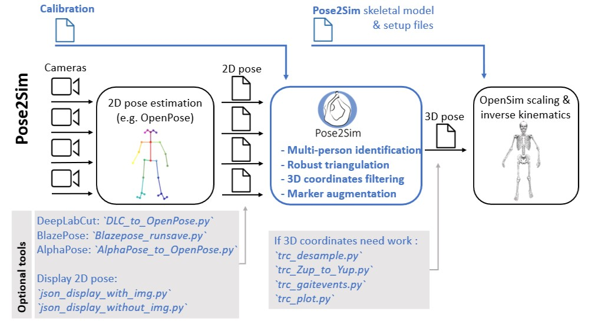

# Summary
`Pose2Sim` provides a workflow for 3D markerless kinematics, as an alternative to the more usual marker-based motion capture methods.
`Pose2Sim` stands for "OpenPose to OpenSim", as it uses `OpenPose` inputs (2D coordinates obtained from multiple videos) and leads to an `OpenSim` result (full-body 3D joint angles). 

The repository presents a framework for:

* Detecting 2D joint coordinates from videos, e.g. via `OpenPose` [@Cao_2019]
* Calibrating cameras
* Detecting the person of interest
* Triangulating 2D joint coordinates and storing them as 3D positions in a .trc file
* Filtering these calculated 3D positions
* Scaling and running inverse kinematics via `OpenSim` [@Delp_2007; @Seth_2018], in order to obtain full-body 3D joint angles

Each task is easily customizable, and requires only moderate Python skills. `Pose2Sim` is accessible at [https://github.com/perfanalytics/pose2sim](https://github.com/perfanalytics/pose2sim). 

# Statement of need
For the last few decades, marker-based kinematics has been considered the best choice for the analysis of human movement, when regarding the trade-off between ease of use and accuracy. However, a marker-based system is hard to set up outdoors or in context, and it requires placing markers on the body, which can hinder natural movement [@Colyer_2018]. 

The emergence of markerless kinematics opens up new possibilities. Indeed, the interest in deep-learning pose estimation neural networks has been growing fast since 2015 [@Zheng_2022], which makes it now possible to collect accurate and reliable kinematic data without the use of physical markers. `OpenPose`, for example, is a widespread open-source software which provides 2D joint coordinate estimates from videos. These coordinates can then be triangulated in order to produce 3D positions. Aside from `Pose2Sim`, a number a tools are available for such triangulation: the experimental `OpenPose 3D reconstruction module` [@Hidalgo_2021], the `FreeMoCap` Python and Blender toolbox [@Matthis_2022], and the `pose3d` Matlab toolbox [@Sheshadri_2020]. Yet, when it comes to the biomechanical analysis of human motion, it is often more useful to obtain joint angles than joint center positions in space. Joint angles allow for better comparison among trials and individuals, and they represent the first step for other analyses such as inverse dynamics. 

`OpenSim` is another widespread open-source software which helps compute 3D joint angles, usually from marker coordinates. It lets scientists define a detailed musculoskeletal model, scale it to individual subjects, and perform inverse kinematics with customizable biomechanical constraints. It provides other features such as net calculation of joint moments or resolution of individual muscle forces, although this is beyond the scope of our contribution.

So far, little work has been done towards obtaining 3D angles from multiple views [@Zheng_2022]. However, three software applications are worth mentioning. `Anipose` [@Karashchuk_2021] proposes a Python open-source framework which allows for joint angle estimation with spatio-temporal constraints, but it is primarily designed for animal motion analysis. `Theia3D` [@Kanko_2021] is a software application for human gait markerless kinematics. Although the GUI is more user friendly, it is neither open-source nor customizable. `OpenCap` [@Uhlrich_2022] has recently been released, and offers a user-friendly web application working with low-cost hardware. It predicts the coordinates of 43 anatomical markers from 20 triangulated keypoints, and imports them in `OpenSim`. However, the source code has not yet been released.

The goal of `Pose2Sim` is to build a bridge between the communities of computer vision and biomechanics, by providing a simple and open-source pipeline connecting the two aforementioned state-of-the-art tools: `OpenPose` and `OpenSim`. The whole workflow runs from any video cameras, on any computer, equipped with any operating system (although `OpenSim` has to be compiled from source on Linux.) `Pose2Sim` has already been used and tested in a number of situations (walking, running, cycling, dancing, balancing, swimming, boxing), and published in peer-reviewed scientific publications assessing its robustness [@Pagnon_2021] and accuracy [@Pagnon_2022]. Its results for inverse kinematics were deemed good when compared to marker-based ones, with errors generally below 4.0° across several activities, on both lower and on upper limbs. The combination of its ease of use, customizable parameters, and high robustness and accuracy makes it promising, especially for "in-the-wild" sports movement analysis.

# Pose2Sim workflow
`Pose2Sim` connects two of the most widely recognized (and open-source) softwares in their respective fields:

* `OpenPose` [@Cao_2019], a 2D human pose estimation neural network
* `OpenSim` [@Delp_2007], a 3D biomechanics analysis software

The workflow is organized as follows (\autoref{fig:pipeline}):

1. Preliminary `OpenPose` [@Cao_2019] 2D keypoints detection
2. `Pose2Sim` core, including 4 customizable steps:
    1. Camera calibration
    2. 2D tracking of the person of interest
    3. 3D keypoint triangulation
    4. 3D coordinate filtering
3. A full-body `OpenSim` [@Delp_2007] skeletal model with `OpenPose` keypoints is provided, as well as scaling and inverse kinematics setup files.

# Pose2Sim method details
`Pose2Sim` is meant to be as fully and easily configurable as possible, by editing the 'User/Config.toml' file. Optional tools are also provided for extending its usage (\autoref{fig:utilities}).

## Project
The user can specify the project path and folder names, the video frame rate, and the range of analyzed frames.

## 2D keypoint detection
It is possible to define which 2D pose estimation model is used. This choice will affect how keypoint indices will be mapped to model markers in `OpenSim`, corresponding to anatomical landmarks or joint centers. Only 21 of the 25 keypoints detected by the default `OpenPose` models are tracked, since eye and ear keypoints would be redundant in the determination of the head orientation.

The `OpenPose` BODY_25B experimental model is recommended, as it is as fast as the standard BODY_25 model, while being more accurate [@Hidalgo_2019]. Non-`OpenPose` models can also be chosen, whether they are human (such as the AlphaPose one [@Fang_2017]), or animal (such as any `DeepLabCut` model trained by the user [@Mathis_2018]). Two optional standalone scripts are also provided if the user desires a visual display of the resulting 2D pose estimation (\autoref{fig:utilities}).

## Camera calibration
The user can indicate whether cameras are going to be calibrated with a checkerboard, or if a preexisting calibration file (such as one provided by a Qualisys system) will simply be converted. 

If checkerboard calibration is chosen, the number of corners and the size of the squares have to be specified. In this case, the operator needs to take at least 10 pictures or one video per camera of the checkerboard, covering as much as the field of view as possible, with different orientations. Corners are then detected and refined with OpenCV. Detected corners can optionally be displayed for verification. Each camera is finally calibrated using OpenCV with an algorithm based on [@Zhang_2000]. The user can choose the index of the image which they want to be used as a reference for calculating extrinsic parameters. Residual calibration errors are given, and stored in a log file.

## Tracking the person of interest
One needs to differentiate the people in the background from the actual subject. The tracking step examines all possible triangulations of a chosen keypoint among all detected persons, and reprojects them on the image planes. The triangulation with the smallest reprojection error is considered to be the one associated with the right person on all cameras. If the reprojection error is above a predefined threshold, the process is repeated after taking off one, or several cameras. This happens, for example, if the person of interest has exited the field of a camera, while another person is still in the background.

We recommend choosing the neck point or one of the hip points. In most cases they are the least likely to move out of the cameras' views. 

## Triangulation
`Pose2Sim` triangulation is robust, largely because instead of using classic Direct Linear Transform (DLT) [@Hartley_1997], we propose a weighted DLT, i.e., a triangulation procedure where each `OpenPose` keypoint coordinate is weighted with its confidence score [@Pagnon_2021]. 

Other parameters can be specified, such as:

* The minimum likelihood (given by `OpenPose` for each detected keypoint) below which a 2D point will not be taken into account for triangulation.\
* The maximum in reprojection error above which triangulation results will not be accepted. This can happen if `OpenPose` provides a bad 2D keypoint estimate, or if the person of interest leaves the camera field. Triangulation will then be tried again on all subsets of all cameras minus one. If the best of the resulting reprojection errors is below the threshold, it is retained. If it is still above the threshold, one more camera is excluded.\
* The minimum number of "good" cameras (i.e., cameras remaining after the last two steps) required for triangulating a keypoint. If there are not enough cameras left, the 3D keypoint is dropped for this frame. 

Once all frames are triangulated, the ones with missing keypoint coordinates are interpolated. The interpolation method can also be chosen from among linear, slinear, quadratic, and cubic. The mean reprojection error over all frames is given for each point and saved to a log file, as well as the number of cameras excluded to reach the demanded thresholds. The resulting 3D coordinates are formatted as a .trc file, which can be read by `OpenSim`.

## Filtering and other operations
Different filters can be chosen, and their parameters can be adjusted. The user can choose a zero-phase low-pass Butterworth filter [@Butterworth_1930] that they can apply either on keypoint positions or on their speeds, a LOESS filter [@Cleveland_1981], a Gaussian filter, or a median filter. Waveforms before and after filtering can be displayed and compared.

If needed, other standalone tools are provided to further work on the .trc 3D coordinate files (\autoref{fig:utilities}). Among others, it is possible to undersample a file from a higher to a lower framerate, or to convert a file from Z-up to Y-up axis convention. The resulting 3D coordinates can be plotted for verification. Additionally, a tool is provided to detect gait events from point coordinates, according to the equations given by [@Zeni_2008]. 

## OpenSim scaling and inverse kinematics
The main contribution of this software is to build a bridge between `OpenPose` and `OpenSim`. The latter allows for much more accurate and robust results [@Pagnon_2022], since it constrains kinematics to an individually scaled and physically accurate skeletal model. Bones are constrained to a constant length, and joints to coherent angle limits.

The provided model is adapted from the human gait full-body model [@Rajagopal_2016] and the lifting full-body model [@Beaucage_2019]. The first one has a better definition of the knee joint: abduction/adduction and internal/external rotation angles are constrained to the flexion/extension angle. The latter has a better definition of the spine: each lumbar vertebra is constrained to the next one, which makes it possible for the spine to bend in a coherent way with only a few tracked keypoints, without having to make it a rigid single bone. Combining those two models allows for ours to be as versatile as possible. Hand movements are locked, because the standard `OpenPose` models don't provide any hand detection. 

This model also takes into account systematic labelling errors in `OpenPose` [@Needham_2021], and offsets model markers as regards true joint centers accordingly. Unlike in marker-based capture, and despite the aforementioned systematic errors, keypoints detection hardly depends on the subject, the operator, nor the context. For this reason, the scaling and the inverse kinematic steps are straightforward, and the provided setup files require little to no adjusting.

# Acknowledgements
We acknowledge the dedicated people involved in the many major software programs and packages used by `Pose2Sim`, such as `Python`, `OpenPose`, `OpenSim`, `OpenCV` [@Bradski_2000], among others. 

# References
