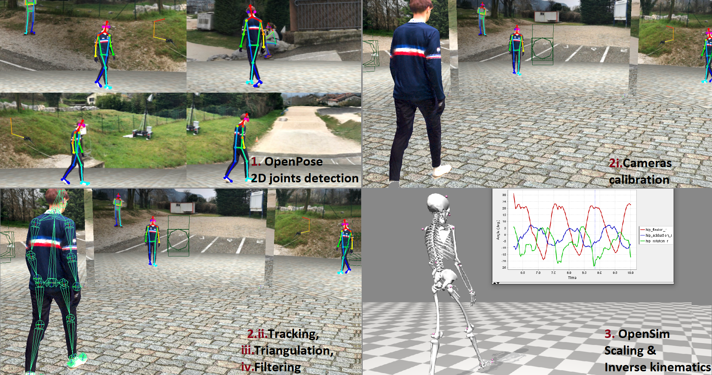

# Summary

`Pose2Sim` offers a way to perform a markerless kinematic analysis of human movement from multiple 
calibrated views under Python, from an Openpose [@Cao_2019] input to an OpenSim [@Delp_2007] result.

The repository presents a framework to perform the following tasks:\
- Calibrating cameras, \
- Tracking the person viewed by the most cameras, in case of several detections by OpenPose,\
- Triangulating 2D coordinates and storing them in a .trc file,\
- Filtering the 3D coordinates,\
- Scaling and running inverse kinematics via OpenSim.

Each task is easily customizable through the 'User/Config.toml' file, and requires only moderate Python skills. Pose2Sim is accessible at [https://gitlab.inria.fr/perfanalytics/pose2sim](https://gitlab.inria.fr/perfanalytics/pose2sim). 

# Statement of need

For the last few decades, marker-based kinematics has been considered as the best choice for the analysis of human movement, when regarding the trade-off between ease-of-use and accuracy. However, it cannot be considered as a gold-standard. Markers can be misplaced, move, or even fall-off, which introduces errors. Moreover, the system is hard to set outside or in "ecological" conditions, and it requires placing markers on the body, which can hinder natural movement. 

The emergence of markerless kinematics opens up new possibilities. Indeed, the interest in deep learning pose estimation neural networks are has been growing fast since 2015 [@Zheng_2022], which makes it now possible to collect accurate and reliable kinematic data without the use of physical markers. Little work has been done towards obtaining 3D angles from multiple views [@Zheng_2022], aside from Theia3D [@Kanko_2021] as a commercial software, and AniPose [@Karashchuk_2021] in the animal motion analysis field.

Our goal is to provide an open source toolbox for researchers and students in biomechanics with little to moderate programming experience. We suggest preprocessing videos with OpenPose [@Cao_2019], an open source, state-of-the-art, and off-the-shelf 2D pose estimation algorithm. Pose2Sim core then proceeds to (1) tracking the person viewed by the most cameras, (2) triangulating 2D coordinates, and (3) filtering the resulting 3D coordinates. It is coded in Python, as it is allegedly easy to learn, widely used, and open source. The 3D point coordinates are finally constrained to a physically consistent full-body skeletal model via OpenSim [@Delp_2007], an open source biomechanical software known to biomechanics researchers, which allows the production of accurate 3D joint angles. 

`Pose2Sim` has already been used and tested in a number of situations (walking, running, cycling, balancing, swimming, boxing), and published in peer-review scientific publications [@Pagnon_2021, @Pagnon_2022] assessing its robustness and accuracy. The combination of its ease of use, customizable characteristics, and robustness and accuracy makes it promising, especially for "in-the-wild" sports movement analysis.

# Features
## Pose2Sim workflow
`Pose2Sim` connects two of the most widely recognized (and open source) pieces of software of their respective fields:\
- OpenPose [@Cao_2019], a 2D human pose estimation neural network\
- OpenSim [@Delp_2007], a 3D biomechanics analysis software

The workflow is organized as follows:\
1. Preliminary Openpose [@Cao_2019] 2D keypoint detection.\
2. Pose2Sim core includes 4 customizable steps:\
&nbsp;&nbsp;&nbsp;&nbsp;2.i. Camera calibration\
&nbsp;&nbsp;&nbsp;&nbsp;2.ii. Tracking of the person viewed by the most cameras\
&nbsp;&nbsp;&nbsp;&nbsp;2.iii. 2D keypoint triangulation\
&nbsp;&nbsp;&nbsp;&nbsp;2.iv. 3D coordinates filtering\
3. A full-body OpenSim [@Delp_2007] skeletal model based on OpenPose keypoints is provided, as well as scaling and inverse kinematics setup files.

OpenPose, OpenSim, as well as the whole `Pose2Sim` workflow run from any video cameras, on any computer, equipped with any operating system. 

## Pose2Sim core
Each step of the Pose2Sim core is easily customizable through the 'User/Config.toml' file. Among other things, users can edit:\
- The project hierarchy, the video framerate, the range of analyzed frames,\
- The OpenPose model they wish to use. They can also use AlphaPose [@Fang_2017], or even create their own model (e.g. with DeepLabCut [@Mathis_2018]),\
- Whether they are going to calibrate their cameras with a checkerboard, or to simply convert a calibration file provided by a Qualisys system,\
- Which keypoint they want to track in order to automatically single out the person of interest,\
- The thresholds in confidence and reprojection error for using or not using a camera while triangulating a keypoint,\
- The minimum number of cameras below which the keypoint won't be triangulated at this frame,\
- The interpolation and filter types and parameters.

## Pose2Sim utilities
Some standalone Python tools are also provided.

**Conversion to and from Pose2Sim** 

`DLC_to_OpenPose.py`
Converts a DeepLabCut [@Mathis_2018] (h5) 2D pose estimation file into OpenPose [@Cao_2019] (json) files.

`calib_qca_to_toml.py`
Converts a Qualisys .qca.txt calibration file to the Pose2Sim .toml calibration file.

`calib_toml_to_qca.py`
Converts a Pose2Sim .toml calibration file (e.g., from a checkerboard) to a Qualisys .qca.txt calibration file.

`calib_from_checkerboard.py`
Calibrates cameras with images or a video of a checkerboard, saves calibration in a Pose2Sim .toml calibration file.

`c3d_to_trc.py`
Converts 3D point data of a .c3d file to a .trc file compatible with OpenSim. No analog data (force plates, emg) nor computed data (angles, powers, etc) are retrieved.

**Plotting tools**

`json_display_with_img.py` 
Overlays 2D detected json coordinates on original raw images. High confidence keypoints are green, low confidence ones are red.

`json_display_without_img.py`
Plots an animation of 2D detected json coordinates. 

`trc_plot.py`
Displays X, Y, Z coordinates of each 3D keypoint of a TRC file in a different matplotlib tab.

**Other trc tools**

`trc_desample.py`
Undersamples a trc file.

`trc_Zup_to_Yup.py`
Changes Z-up system coordinates to Y-up system coordinates.

`trc_filter.py`
Filters trc files. Available filters: Butterworth, Butterworth on speed, Gaussian, LOESS, Median.

`trc_gaitevents.py`
Detects gait events from point coordinates according to [@Zeni_2008].

# Acknowledgements

We acknowledge the dedicated people involved in major software programs and packages used by Pose2Sim, such as Python, OpenPose, OpenSim, OpenCV, and many others.

# References
