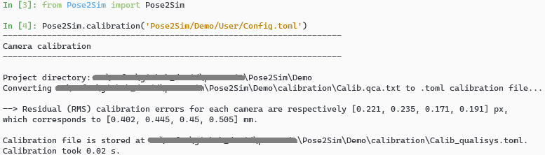
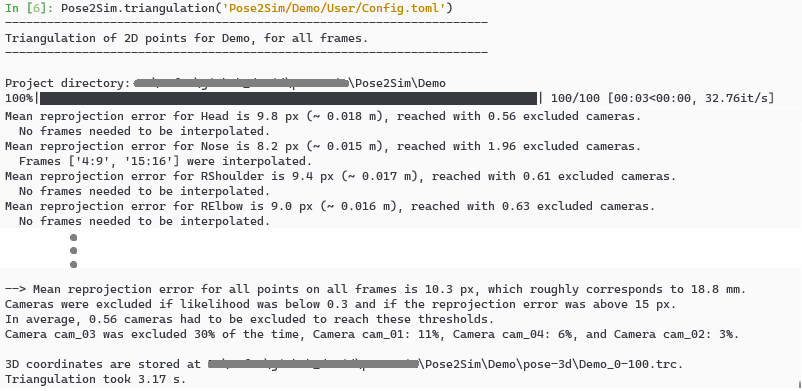
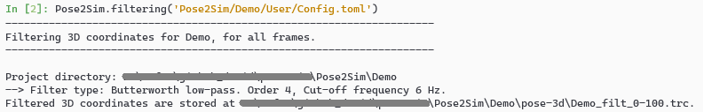

[](https://github.com/perfanalytics/pose2sim/actions/workflows/continuous-integration.yml)
[](https://badge.fury.io/py/Pose2Sim) \
[](https://pepy.tech/project/pose2sim)
[](https://github.com/perfanalytics/pose2sim/stargazers)
[](https://GitHub.com/perfanalytics/pose2sim/forks)
[](https://github.com/perfanalytics/pose2sim/issues)
[](https://GitHub.com/perfanalytics/pose2sim/issues?q=is%3Aissue+is%3Aclosed)
\
[](https://joss.theoj.org/papers/a31cb207a180f7ac9838d049e3a0de26)
[](https://zenodo.org/badge/latestdoi/501642916)
[](https://opensource.org/licenses/BSD-3-Clause)


# Pose2Sim

> **_News_: Version 0.4 released:** \
**Calibration used to be the main stumbling block for users: it should be easier and better now!**\
To upgrade, type `pip install pose2sim --upgrade`. You will need to update your [User\Config.toml](https://github.com/perfanalytics/pose2sim/blob/main/Pose2Sim/Empty_project/User/Config.toml) file.\
*N.B.:* As always, I am more than happy to welcome contributors (see [How to contribute](#how-to-contribute)).

`Pose2Sim` provides a workflow for 3D markerless kinematics, as an alternative to the more usual marker-based motion capture methods. It aims to provide a free tool to obtain research-grade results from consumer-grade equipment. Any combination of phone, webcam, gopro, etc can be used.

Pose2Sim stands for "OpenPose to OpenSim", as it uses OpenPose inputs (2D keypoints coordinates obtained from multiple videos) and leads to an OpenSim result (full-body 3D joint angles). Other 2D pose estimators can alternatively be used as inputs.

If you can only use one single camera and don't mind losing some accuracy, please consider using [Sports2D](https://github.com/davidpagnon/Sports2D).


# Contents
1. [Installation and Demonstration](#installation-and-demonstration)
   1. [Installation](#installation)
   2. [Demonstration Part-1: Build 3D TRC file on Python](#demonstration-part-1-build-3d-trc-file-on-python)
   3. [Demonstration Part-2: Obtain 3D joint angles with OpenSim](#demonstration-part-2-obtain-3d-joint-angles-with-opensim)
2. [Use on your own data](#use-on-your-own-data)
   1. [Prepare for running on your own data](#prepare-for-running-on-your-own-data)
   2. [2D pose estimation](#2d-pose-estimation)
      1. [With OpenPose](#with-openpose)
      2. [With Mediapipe](#with-mediapipe)
      3. [With DeepLabCut](#with-deeplabcut)
      4. [With AlphaPose](#with-alphapose)
   3. [Camera calibration](#camera-calibration)
      1. [Convert from Qualisys, Optitrack, Vicon, OpenCap, EasyMocap, or bioCV](#convert-from-qualisys-optitrack-vicon-opencap-easymocap-or-biocv)
      2. [Calculate from scratch](#calculate-from-scratch)
   4. [Camera synchronization](#camera-synchronization)
   5. [Tracking, Triangulating, Filtering](#tracking-triangulating-filtering)
      1. [Associate persons across cameras](#associate-persons-across-cameras)
      2. [Triangulating keypoints](#triangulating-keypoints)
      3. [Filtering 3D coordinates](#filtering-3d-coordinates)
   6. [OpenSim kinematics](#opensim-kinematics)
      1. [OpenSim Scaling](#opensim-scaling)
      2. [OpenSim Inverse kinematics](#opensim-inverse-kinematics)
      3. [Command Line](#command-line)
   7. [Batch processing](#batch-processing)
3. [Utilities](#utilities)
4. [How to cite and how to contribute](#how-to-cite-and-how-to-contribute)
   1. [How to cite](#how-to-cite)
   2. [How to contribute and to-do list](#how-to-contribute-and-to-do-list)

# Installation and Demonstration

## Installation
1. **Install OpenPose** (instructions [there](https://github.com/CMU-Perceptual-Computing-Lab/openpose/blob/master/doc/installation/0_index.md)). \
*Windows portable demo is enough.*
2. **Install OpenSim 4.x** ([there](https://simtk.org/frs/index.php?group_id=91)). \
*Tested up to v4.4-beta on Windows. Has to be compiled from source on Linux (see [there](https://simtk-confluence.stanford.edu:8443/display/OpenSim/Linux+Support)).*
3. ***Optional.*** *Install Anaconda or [Miniconda](https://docs.conda.io/en/latest/miniconda.html). \
   Open an Anaconda terminal and create a virtual environment with typing:*
   <pre><i>conda create -n Pose2Sim python=3.8 -y 
   conda activate Pose2Sim</i></pre>
   
3. **Install Pose2Sim**:\
If you don't use Anaconda, type `python -V` in terminal to make sure python>=3.8 is installed.
   - OPTION 1: **Quick install:** Open a terminal. 
       ``` cmd
       pip install pose2sim
       ```
     
   - OPTION 2: **Build from source and test the last changes:**
     Open a terminal in the directory of your choice and Clone the Pose2Sim repository.
       ``` cmd
       git clone --depth 1 https://github.com/perfanalytics/pose2sim.git
       cd pose2sim
       pip install .
       ```
          
## Demonstration Part-1: Build 3D TRC file on Python  
> _**This demonstration provides an example experiment of a person balancing on a beam, filmed with 4 calibrated cameras processed with OpenPose.**_ 

Open a terminal, enter `pip show pose2sim`, report package location. \
Copy this path and go to the Demo folder with `cd <path>\pose2sim\Demo`. \
Type `ipython`, and test the following code:
``` python
from Pose2Sim import Pose2Sim
Pose2Sim.calibration()
Pose2Sim.personAssociation()
Pose2Sim.triangulation()
Pose2Sim.filtering()
```
You should obtain a plot of all the 3D coordinates trajectories. You can check the logs in`Demo\Users\logs.txt`.\
Results are stored as .trc files in the `Demo/pose-3d` directory.

*N.B.:* Default parameters have been provided in [Demo\User\Config.toml](https://github.com/perfanalytics/pose2sim/blob/main/Pose2Sim/Demo/User/Config.toml) but can be edited.\
*N.B.:* *Try calibration tool by changing `calibration_type` to `calculate` instead of `convert` (more info [there](#calculate-from-scratch)).*
<br/>

## Demonstration Part-2: Obtain 3D joint angles with OpenSim  
> _**In the same vein as you would do with marker-based kinematics, start with scaling your model, and then perform inverse kinematics.**_ 

### Scaling
1. Open OpenSim.
2. Open the provided `Model_Pose2Sim_Body25b.osim` model from `pose2sim/Demo/opensim`. *(File -> Open Model)*
3. Load the provided `Scaling_Setup_Pose2Sim_Body25b.xml` scaling file from `pose2sim/Demo/opensim`. *(Tools -> Scale model -> Load)*
4. Run. You should see your skeletal model take the static pose.

### Inverse kinematics
1. Load the provided `IK_Setup_Pose2Sim_Body25b.xml` scaling file from `pose2sim/Demo/opensim`. *(Tools -> Inverse kinematics -> Load)*
2. Run. You should see your skeletal model move in the Vizualizer window.
<br/>

# Use on your own data

> _**Deeper explanations and instructions are given below.**_

## Prepare for running on your own data
  > _**Get ready.**_
  
  1. Find your `Pose2Sim\Empty_project`, copy-paste it where you like and give it the name of your choice.
  2. Edit the [User\Config.toml](https://github.com/perfanalytics/pose2sim/blob/main/Pose2Sim/Empty_project/User/Config.toml) file as needed, **especially regarding the path to your project**. 
  3. Populate the `raw-2d`folder with your videos.
  
       <pre>
       Project
       │
       ├──opensim
       │    ├──Geometry
       │    ├──Model_Pose2Sim_Body25b.osim
       │    ├──Scaling_Setup_Pose2Sim_Body25b.xml
       │    └──IK_Setup_Pose2Sim_Body25b.xml
       │        
       ├── <b>raw
       │    ├──vid_cam1.mp4 (or other extension)
       │    ├──...
       │    └──vid_camN.mp4</b>
       │
       └──User
           └──Config.toml
       </b>
    
## 2D pose estimation
> _**Estimate 2D pose from images with Openpose or another pose estimation solution.**_ \
N.B.: First film a short static pose that will be used for scaling the OpenSim model (A-pose for example), and then film your motions of interest.\
N.B.: Note that the names of your camera folders must follow the same order as in the calibration file, and end with '_json'.

### With OpenPose:
The accuracy and robustness of Pose2Sim have been thoroughly assessed only with OpenPose, and especially with the BODY_25B model. Consequently, we recommend using this 2D pose estimation solution. See [OpenPose repository](https://github.com/CMU-Perceptual-Computing-Lab/openpose) for installation and running.
* Open a command prompt in your **OpenPose** directory. \
  Launch OpenPose for each raw image folder: 
  ``` cmd
  bin\OpenPoseDemo.exe --model_pose BODY_25B --video <PATH_TO_PROJECT_DIR>\raw-2d\vid_cam1.mp4 --write_json <PATH_TO_PROJECT_DIR>\pose-2d\pose_cam1_json
  ```
* The [BODY_25B model](https://github.com/CMU-Perceptual-Computing-Lab/openpose_train/tree/master/experimental_models) has more accurate results than the standard BODY_25 one and has been extensively tested for Pose2Sim. \
You can also use the [BODY_135 model](https://github.com/CMU-Perceptual-Computing-Lab/openpose_train/tree/master/experimental_models), which allows for the evaluation of pronation/supination, wrist flexion, and wrist deviation.\
All other OpenPose models (BODY_25, COCO, MPII) are also supported.\
Make sure you modify the [User\Config.toml](https://github.com/perfanalytics/pose2sim/blob/main/Pose2Sim/Empty_project/User/Config.toml) file accordingly.
* Use one of the `json_display_with_img.py` or `json_display_with_img.py` scripts (see [Utilities](#utilities)) if you want to display 2D pose detections.

**N.B.:** *OpenPose BODY_25B is the default 2D pose estimation model used in Pose2Sim. However, other skeleton models from other 2D pose estimation solutions can be used alternatively.* 


### With MediaPipe:
[Mediapipe BlazePose](https://google.github.io/mediapipe/solutions/pose.html) is very fast, fully runs under Python, handles upside-down postures and wrist movements (but no subtalar ankle angles). \
However, it is less robust and accurate than OpenPose, and can only detect a single person.
* Use the script `Blazepose_runsave.py` (see [Utilities](#utilities)) to run BlazePose under Python, and store the detected coordinates in OpenPose (json) or DeepLabCut (h5 or csv) format: 
  ``` cmd
  python -m Blazepose_runsave -i rinput_file -dJs
  ```
  Type in `python -m Blazepose_runsave -h` for explanation on parameters.
* Make sure you changed the `pose_model` and the `tracked_keypoint` in the [User\Config.toml](https://github.com/perfanalytics/pose2sim/blob/main/Pose2Sim/Empty_project/User/Config.toml) file.

### With DeepLabCut:
If you need to detect specific points on a human being, an animal, or an object, you can also train your own model with [DeepLabCut](https://github.com/DeepLabCut/DeepLabCut).
1. Train your DeepLabCut model and run it on your images or videos (more instruction on their repository)
2. Translate the h5 2D coordinates to json files (with `DLC_to_OpenPose.py` script, see [Utilities](#utilities)): 
   ``` cmd
   python -m DLC_to_OpenPose -i input_h5_file
   ```
3. Edit `pose.CUSTOM` in [User\Config.toml](https://github.com/perfanalytics/pose2sim/blob/main/Pose2Sim/Empty_project/User/Config.toml), and edit the node ids so that they correspond to the column numbers of the 2D pose file, starting from zero. Make sure you also changed the `pose_model` and the `tracked_keypoint`.\
   You can visualize your skeleton's hierarchy by changing pose_model to CUSTOM and writing these lines: 
   ``` python
    config_path = r'path_to_Config.toml'
    import toml, anytree
    config = toml.load(config_path)
    pose_model = config.get('pose').get('pose_model')
    model = DictImporter().import_(config.get('pose').get(pose_model))
    for pre, _, node in RenderTree(model): 
        print(f'{pre}{node.name} id={node.id}')
   ```
4. Create an OpenSim model if you need inverse kinematics.

### With AlphaPose:
[AlphaPose](https://github.com/MVIG-SJTU/AlphaPose) is one of the main competitors of OpenPose, and its accuracy is comparable. As a top-down approach (unlike OpenPose which is bottom-up), it is faster on single-person detection, but slower on multi-person detection.\
All AlphaPose models are supported (HALPE_26, HALPE_68, HALPE_136, COCO_133, COCO, MPII). For COCO and MPII, AlphaPose must be run with the flag "--format cmu".
* Install and run AlphaPose on your videos (more instruction on their repository)
* Translate the AlphaPose single json file to OpenPose frame-by-frame files (with `AlphaPose_to_OpenPose.py` script, see [Utilities](#utilities)): 
   ``` cmd
   python -m AlphaPose_to_OpenPose -i input_alphapose_json_file
   ```
* Make sure you changed the `pose_model` and the `tracked_keypoint` in the [User\Config.toml](https://github.com/perfanalytics/pose2sim/blob/main/Pose2Sim/Empty_project/User/Config.toml) file.

<details>
  <summary>The project hierarchy becomes: (CLICK TO SHOW)</summary>
    <pre>
   Project
   │
   ├──opensim
   │    ├──Geometry
   │    ├──Model_Pose2Sim_Body25b.osim
   │    ├──Scaling_Setup_Pose2Sim_Body25b.xml
   │    └──IK_Setup_Pose2Sim_Body25b.xml
   │
   <i><b>├──pose-2d
   │    ├──pose_cam1_json
   │    ├──...
   │    └──pose_camN_json</i></b>
   │        
   ├── raw-2d
   │    ├──vid_cam1.mp4
   │    ├──...
   │    └──vid_camN.mp4
   │
   └──User
       └──Config.toml
   </pre>
</details>

## Camera calibration
> _**Calculate camera intrinsic properties and extrinsic locations and positions.\
> Convert a preexisting calibration file, or calculate intrinsic and extrinsic parameters from scratch.**_ \
> _**N.B.:**_ You can visualize camera calibration in 3D with my (experimental) [Maya-Mocap tool](https://github.com/davidpagnon/Maya-Mocap). 

Open an Anaconda prompt or a terminal, type `ipython`.\
By default, `calibration()` will look for `Config.toml` in the `User` folder of your current directory. If you want to store it somewhere else (e.g. in your data directory), specify this path as an argument: `Pose2Sim.calibration(r'path_to_config.toml')`.

``` python
from Pose2Sim import Pose2Sim
Pose2Sim.calibration()
```

Output:\



### Convert from Qualisys, Optitrack, Vicon, OpenCap, EasyMocap, or bioCV

> N.B.: Since Pose2Sim uses the [Aniposelib](https://anipose.readthedocs.io/en/latest/aniposelibtutorial.html) format, calibration does not need to be run if you already have an [AniPose](https://github.com/lambdaloop/anipose) or [FreeMocap](https://github.com/freemocap/freemocap) calibration .toml file. 
      
If you already have a calibration file, set `calibration_type` type to `convert` in your [User\Config.toml](https://github.com/perfanalytics/pose2sim/blob/main/Pose2Sim/Empty_project/User/Config.toml) file.
- **From [Qualisys](https://www.qualisys.com):**
  - Export calibration to `.qca.txt` within QTM.
  - Copy it in the `calibration` Pose2Sim folder.
  - set `convert_from` to 'qualisys' in your [User\Config.toml](https://github.com/perfanalytics/pose2sim/blob/main/Pose2Sim/Empty_project/User/Config.toml) file. Change `binning_factor` to 2 if you film in 540p.
- **From [Optitrack](https://optitrack.com/):** Exporting calibration will be available in Motive 3.2. In the meantime:
  - Calculate intrinsics with a board (see next section).
  - Use their C++ API [to retrieve extrinsic properties](https://docs.optitrack.com/developer-tools/motive-api/motive-api-function-reference#tt_cameraxlocation). Translation can be copied as is in your `Calib.toml` file, but TT_CameraOrientationMatrix first needs to be [converted to a Rodrigues vector](https://docs.opencv.org/3.4/d9/d0c/group__calib3d.html#ga61585db663d9da06b68e70cfbf6a1eac) with OpenCV. See instructions [here](https://github.com/perfanalytics/pose2sim/issues/28).
  - Use the `Calib.toml` file as is and do not run Pose2Sim.calibration()
- **From [Vicon](http://www.vicon.com/Software/Nexus):**  
  - Copy your `.xcp` Vicon calibration file to the Pose2Sim `calibration` folder.
  - set `convert_from` to 'vicon' in your [User\Config.toml](https://github.com/perfanalytics/pose2sim/blob/main/Pose2Sim/Empty_project/User/Config.toml) file. No other setting is needed.
- **From [OpenCap](https://www.opencap.ai/):**  
  - Copy your `.pickle` OpenCap calibration files to the Pose2Sim `calibration` folder.
  - set `convert_from` to 'opencap' in your [User\Config.toml](https://github.com/perfanalytics/pose2sim/blob/main/Pose2Sim/Empty_project/User/Config.toml) file. No other setting is needed.
- **From [EasyMocap](https://github.com/zju3dv/EasyMocap/):**  
  - Copy your `intri.yml` and `extri.yml` files to the Pose2Sim `calibration` folder.
  - set `convert_from` to 'easymocap' in your [User\Config.toml](https://github.com/perfanalytics/pose2sim/blob/main/Pose2Sim/Empty_project/User/Config.toml) file. No other setting is needed.
- **From [bioCV](https://github.com/camera-mc-dev/.github/blob/main/profile/mocapPipe.md):**  
  - Copy your bioCV calibration files (no extension) to the Pose2Sim `calibration` folder.
  - set `convert_from` to 'biocv' in your [User\Config.toml](https://github.com/perfanalytics/pose2sim/blob/main/Pose2Sim/Empty_project/User/Config.toml) file. No other setting is needed.


### Calculate from scratch

> Calculate calibration parameters with a board, or with points (such as detected on a wand or a human body).

- **With a board:**
  > *N.B.:* Try the calibration tool on the Demo by changing `calibration_type` to `calculate` in [User\Config.toml](https://github.com/perfanalytics/pose2sim/blob/main/Pose2Sim/Empty_project/User/Config.toml).\
  For the sake of practicality, there are voluntarily few board images for intrinsic calibration, and few points to click for extrinsic calibration. In spite of this, your reprojection error should be under 1-2 cm, which [does not hinder the quality of kinematic results in practice](https://www.mdpi.com/1424-8220/21/19/6530/htm#:~:text=Angle%20results%20were,Table%203).).
  
  - **Calculate intrinsic parameters:**

    > *N.B.:* _Intrinsic parameters:_ camera properties (focal length, optical center, distortion), usually need to be calculated only once in their lifetime. In theory, cameras with same model and same settings will have identical intrinsic parameters.\
    > *N.B.:* If you already calculated intrinsic parameters earlier, you can skip this step. Copy your intrinsic parameters (`size`, `mat`, and `dist`) in a new `Calib*.toml` file, and set `overwrite_intrinsics` to false. Run Demo to obtain an example `Calib.toml` file.

    - Create a folder for each camera in your `calibration\intrinsics` folder.
    - For each camera, film a checkerboard or a charucoboard. Either the board or the camera can be moved.
    - Adjust parameters in the [User\Config.toml](https://github.com/perfanalytics/pose2sim/blob/main/Pose2Sim/Empty_project/User/Config.toml) file.
    - Make sure that the board:\
      is filmed from different angles, covers a large part of the video frame, and is in focus.\
      is flat, without reflections, surrounded by a white border, and is not rotationally invariant (Nrows ≠ Ncols, and Nrows odd if Ncols even).
    - A common error is to specify the external, instead of the internal number of corners. This may be one less than you would intuitively think. 
    
    

    ***Intrinsic calibration error should be below 0.5 px.***
        
  - **Calculate extrinsic parameters:** 

    > *N.B.:* _Extrinsic parameters:_ camera placement in space (position and orientation), need to be calculated every time a camera is moved. Can be calculated from a board, or from points in the scene with known coordinates.

    - Create a folder for each camera in your `calibration\extrinsics` folder.
    - Once your cameras are in place, shortly film either a board laid on the floor, or the raw scene\
    (only one frame is needed, but do not just take a photo unless you are sure it does not change the image format).
    - Adjust parameters in the [User\Config.toml](https://github.com/perfanalytics/pose2sim/blob/main/Pose2Sim/Empty_project/User/Config.toml) file.
    - Then,
      - **If you film a board:**\
        Make sure that it is seen by all cameras. \
        It should preferably be larger than the one used for intrinsics, as results will not be very accurate out of the covered zone.
      - **If you film the raw scene** (more flexible and potentially more accurate if points are spread out):\
        Manually measure the 3D coordinates of 10 or more points in the scene (tiles, lines on wall, boxes, treadmill dimensions, etc). These points should be as spread out as possible.\
        Then you will click on the corresponding image points for each view.
    
    
    
    ***Intrinsic calibration error should be below 1 cm, but depending on your application, results will still be potentially acceptable up to 2.5 cm.***

- **With points:**
  - Points can be detected from a wand.\
  [Want to contribute?](#how-to-contribute)
  - For a more automatic calibration, OpenPose keypoints could also be used for calibration.\
  [Want to contribute?](#how-to-contribute) 

<details>
  <summary>The project hierarchy becomes: (CLICK TO SHOW)</summary>
    <pre>
   Project
   │
   ├──<i><b>calibration
   │   ├──intrinsics
   │   │  ├──int_cam1_img
   │   │  ├──...
   │   │  └──int_camN_img
   │   ├──extrinsics
   │   │  ├──ext_cam1_img
   │   │  ├──...
   │   │  └──ext_camN_img
   │   └──Calib.toml</i></b>
   │
   ├──opensim
   │    ├──Geometry
   │    ├──Model_Pose2Sim_Body25b.osim
   │    ├──Scaling_Setup_Pose2Sim_Body25b.xml
   │    └──IK_Setup_Pose2Sim_Body25b.xml
   │
   ├──pose-2d
   │    ├──pose_cam1_json
   │    ├──...
   │    └──pose_camN_json
   │        
   ├── raw-2d
   │    ├──vid_cam1.mp4
   │    ├──...
   │    └──vid_camN.mp4
   │
   └──User
       └──Config.toml
   </pre>
</details>


## Camera synchronization

> _**Cameras need to be synchronized, so that 2D points correspond to the same position across cameras.**_\
*N.B.: Skip this step if your cameras are already synchronized.*

If your cameras are not natively synchronized, you can use [this script](https://github.com/perfanalytics/pose2sim/blob/draft/Pose2Sim/Utilities/synchronize_cams.py).\
Alternatively, use a clap, a flash, or a beep noise to synchronize them.


## Tracking, Triangulating, Filtering

### Associate persons across cameras

> _**Track the person viewed by the most cameras, in case of several detections by OpenPose.**_ \
*N.B.: Skip this step if only one person is in the field of view.*\
> [Want to contribute?](#how-to-contribute) _**Allow for multiple person analysis.**_


Open an Anaconda prompt or a terminal, type `ipython`.\
By default, `personAssociation()` will look for `Config.toml` in the `User` folder of your current directory. If you want to store it somewhere else (e.g. in your data directory), specify this path as an argument: `Pose2Sim.personAssociation(r'path_to_config.toml')`.
``` python
from Pose2Sim import Pose2Sim
Pose2Sim.personAssociation()
```

Check printed output. If results are not satisfying, try and release the constraints in the [User\Config.toml](https://github.com/perfanalytics/pose2sim/blob/main/Pose2Sim/Empty_project/User/Config.toml) file.

Output:\


<details>
  <summary>The project hierarchy becomes: (CLICK TO SHOW)</summary>
    <pre>
   Project
   │
   ├──calibration
   │   ├──intrinsics
   │   │  ├──int_cam1_img
   │   │  ├──...
   │   │  └──int_camN_img
   │   ├──extrinsics
   │   │  ├──ext_cam1_img
   │   │  ├──...
   │   │  └──ext_camN_img
   │   └──Calib.toml
   │
   ├──opensim
   │    ├──Geometry
   │    ├──Model_Pose2Sim_Body25b.osim
   │    ├──Scaling_Setup_Pose2Sim_Body25b.xml
   │    └──IK_Setup_Pose2Sim_Body25b.xml
   │
   ├──pose-2d
   │   ├──pose_cam1_json
   │   ├──...
   │   └──pose_camN_json
   │
   <i><b>├──pose-2d-tracked
   │   ├──tracked_cam1_json
   │   ├──...
   │   └──tracked_camN_json</i></b>
   │        
   ├── raw-2d
   │    ├──vid_cam1.mp4
   │    ├──...
   │    └──vid_camN.mp4
   │
   └──User
       └──Config.toml
   </pre>
</details>
   

### Triangulating keypoints
> _**Triangulate your 2D coordinates in a robust way.**_ \
> _**N.B.:**_ You can visualize your resulting 3D coordinates with my (experimental) [Maya-Mocap tool](https://github.com/davidpagnon/Maya-Mocap). 

Open an Anaconda prompt or a terminal, type `ipython`.\
By default, `triangulation()` will look for `Config.toml` in the `User` folder of your current directory. If you want to store it somewhere else (e.g. in your data directory), specify this path as an argument: `Pose2Sim.triangulation(r'path_to_config.toml')`.

``` python
from Pose2Sim import Pose2Sim
Pose2Sim.triangulation()
```

Check printed output, and vizualise your trc in OpenSim: `File -> Preview experimental data`.\
If your triangulation is not satisfying, try and release the constraints in the `Config.toml` file.

Output:\



<details>
  <summary>The project hierarchy becomes: (CLICK TO SHOW)</summary>
    <pre>
   Project
   │
   ├──calibration
   │   ├──intrinsics
   │   │  ├──int_cam1_img
   │   │  ├──...
   │   │  └──int_camN_img
   │   ├──extrinsics
   │   │  ├──ext_cam1_img
   │   │  ├──...
   │   │  └──ext_camN_img
   │   └──Calib.toml
   │
   ├──opensim
   │    ├──Geometry
   │    ├──Model_Pose2Sim_Body25b.osim
   │    ├──Scaling_Setup_Pose2Sim_Body25b.xml
   │    └──IK_Setup_Pose2Sim_Body25b.xml
   │
   ├──pose-2d
   │   ├──pose_cam1_json
   │   ├──...
   │   └──pose_camN_json
   │
   ├──pose-2d-tracked
   │   ├──tracked_cam1_json
   │   ├──...
   │   └──tracked_camN_json
   │
   <i><b>├──pose-3d
       └──Pose-3d.trc</i></b>>
   │        
   ├── raw-2d
   │    ├──vid_cam1.mp4
   │    ├──...
   │    └──vid_camN.mp4
   │
   └──User
       └──Config.toml
   </pre>
</details>


### Filtering 3D coordinates
> _**Filter your 3D coordinates.**_\
> _**N.B.:**_ You can visualize your resulting filtered 3D coordinates with my (experimental) [Maya-Mocap tool](https://github.com/davidpagnon/Maya-Mocap). 

Open an Anaconda prompt or a terminal, type `ipython`.\
By default, `filtering()` will look for `Config.toml` in the `User` folder of your current directory. If you want to store it somewhere else (e.g. in your data directory), specify this path as an argument: `Pose2Sim.filtering(r'path_to_config.toml')`.

``` python
from Pose2Sim import Pose2Sim
Pose2Sim.filtering()
```

Check your filtration with the displayed figures, and vizualise your trc in OpenSim. If your filtering is not satisfying, try and change the parameters in the `Config.toml` file.

Output:\





<details>
  <summary>The project hierarchy becomes: (CLICK TO SHOW)</summary>
    <pre>
   Project
   │
   ├──calibration
   │   ├──intrinsics
   │   │  ├──int_cam1_img
   │   │  ├──...
   │   │  └──int_camN_img
   │   ├──extrinsics
   │   │  ├──ext_cam1_img
   │   │  ├──...
   │   │  └──ext_camN_img
   │   └──Calib.toml
   │
   ├──opensim
   │    ├──Geometry
   │    ├──Model_Pose2Sim_Body25b.osim
   │    ├──Scaling_Setup_Pose2Sim_Body25b.xml
   │    └──IK_Setup_Pose2Sim_Body25b.xml
   │
   ├──pose-2d
   │   ├──pose_cam1_json
   │   ├──...
   │   └──pose_camN_json
   │
   ├──pose-2d-tracked
   │   ├──tracked_cam1_json
   │   ├──...
   │   └──tracked_camN_json
   │
   <i><b>├──pose-3d
   │   ├──Pose-3d.trc
   │   └──Pose-3d-filtered.trc</i></b>
   │        
   ├── raw-2d
   │    ├──vid_cam1.mp4
   │    ├──...
   │    └──vid_camN.mp4
   │
   └──User
       └──Config.toml
   </pre>
</details>


## OpenSim kinematics
> _**Obtain 3D joint angles.**_

### OpenSim Scaling
1. Use the previous steps to capture a static pose, typically an A-pose or a T-pose.
2. Open OpenSim.
3. Open the provided `Model_Pose2Sim_Body25b.osim` model from `pose2sim/Empty_project/opensim`. *(File -> Open Model)*
4. Load the provided `Scaling_Setup_Pose2Sim_Body25b.xml` scaling file from `pose2sim/Empty_project/opensim`. *(Tools -> Scale model -> Load)*
5. Replace the example static .trc file with your own data.
6. Run
7. Save the new scaled OpenSim model.

### OpenSim Inverse kinematics
1. Use Pose2Sim to generate 3D trajectories.
2. Open OpenSim.
3. Load the provided `IK_Setup_Pose2Sim_Body25b.xml` scaling file from `pose2sim/Empty_project/opensim`. *(Tools -> Inverse kinematics -> Load)*
4. Replace the example .trc file with your own data, and specify the path to your angle kinematics output file.
5. Run
6. Motion results will appear as .mot file in the `pose2sim/Empty_project/opensim` directory (automatically saved).


### Command line
Alternatively, you can use command-line tools:

- Open an Anaconda terminal in your OpenSim/bin directory, typically `C:\OpenSim <Version>\bin`.\
  You'll need to adjust the `time_range`, `output_motion_file`, and enter the full paths to the input and output `.osim`, `.trc`, and `.mot` files in your setup file.
  ``` cmd
  opensim-cmd run-tool <PATH TO YOUR SCALING OR IK SETUP FILE>.xml
  ```

- You can also run OpenSim directly in Python:
  ``` python
  import subprocess
  subprocess.call(["opensim-cmd", "run-tool", r"<PATH TO YOUR SCALING OR IK SETUP FILE>.xml"])
  ```

- Or take advantage of the full the OpenSim Python API. See [there](https://simtk-confluence.stanford.edu:8443/display/OpenSim/Scripting+in+Python) for installation instructions (conda install may take a while).\
Make sure to replace `py38np120` with your Python version (3.8 in this case) and with your numpy version (1.20 here).
  ``` cmd
  conda install -c opensim-org opensim-moco=4.4=py38np120 -y
  ```
  If you run into a DLL error while importing opensim, open the file `<Pose2Sim-env>\Lib\opensim\__init__.py` and replace `conda`by `conda-meta` line 4. `<Pose2Sim-env>` location can be found with `conda env list`.\
  Then run: 
  `ipython`
  ``` python
  import opensim
  opensim.ScaleTool("<PATH TO YOUR SCALING OR IK SETUP FILE>.xml").run()
  opensim.InverseKinematicsTool("<PATH TO YOUR SCALING OR IK SETUP FILE>.xml").run()
  ```
  You can also run other API commands. See [there](https://simtk-confluence.stanford.edu:8443/display/OpenSim/Common+Scripting+Commands#CommonScriptingCommands-UsingtheTools) for more instructions on how to use it.

<details>
  <summary>The project hierarchy becomes: (CLICK TO SHOW)</summary>
    <pre>
   Project
   │
   ├──calibration
   │   ├──intrinsics
   │   │  ├──int_cam1_img
   │   │  ├──...
   │   │  └──int_camN_img
   │   ├──extrinsics
   │   │  ├──ext_cam1_img
   │   │  ├──...
   │   │  └──ext_camN_img
   │   └──Calib.toml
   │
   ├──<i><b>opensim</i></b>  
   │    ├──Geometry
   │    ├──Model_Pose2Sim_Body25b.osim
   │    ├──Scaling_Setup_Pose2Sim_Body25b.xml
   │    ├──<i><b>Model_Pose2Sim_Body25b_Scaled.osim</i></b>  
   │    ├──IK_Setup_Pose2Sim_Body25b.xml
   │    └──<i><b>IK_result.mot</i></b>   
   │
   ├──pose
   │   ├──pose_cam1_json
   │   ├──...
   │   └──pose_camN_json
   │
   ├──pose-associated
   │   ├──tracked_cam1_json
   │   ├──...
   │   └──tracked_camN_json
   │
   ├──triangulation
   │   ├──triangulation.trc
   │   └──triangulation-filtered.trc
   │        
   ├── raw
   │    ├──vid_cam1.mp4
   │    ├──...
   │    └──vid_camN.mp4
   │
   └──User
       └──Config.toml
   </pre>
</details>


## Batch processing
If you need to batch process multiple data or with multiple different parameters, you can run any Pose2Sim function with a `config` dictionary instead of a file. For example:
``` python
from Pose2Sim import Pose2Sim
import toml

config_dict = toml.load('User/Config.toml')
config_dict['project']['pose_folder_name'] = new_project_path
Pose2Sim.triangulate(config_dict)
```
Or into a loop:
``` python
from Pose2Sim import Pose2Sim
import toml
config_dict = toml.load('User/Config.toml')

# Change project_path
for new_project_path in new_project_paths:
  config_dict['project']['project_dir'] = new_project_path
  config_dict['filtering']['display_figures'] = False

  # Run any Pose2Sim function with config_dict instead of a path
  Pose2Sim.triangulation(config_dict)
  
  # Now change filtering type
  for new_filter in ['butterworth', 'kalman', 'gaussian']:
    config_dict['filtering']['type'] = new_filter
    Pose2Sim.filtering(config_dict)
```


# Utilities
A list of standalone tools (see [Utilities](https://github.com/perfanalytics/pose2sim/tree/main/Pose2Sim/Utilities)), which can be either run as scripts, or imported as functions. Check usage in the docstrings of each Python file. The figure below shows how some of these toolscan be used to further extend Pose2Sim usage.


<details>
  <summary><b>Converting calibration files</b> (CLICK TO SHOW)</summary>
    <pre>

[Blazepose_runsave.py](https://github.com/perfanalytics/pose2sim/blob/main/Pose2Sim/Utilities/Blazepose_runsave.py)
Runs BlazePose on a video, and saves coordinates in OpenPose (json) or DeepLabCut (h5 or csv) format.

[DLC_to_OpenPose.py](https://github.com/perfanalytics/pose2sim/blob/main/Pose2Sim/Utilities/DLC_to_OpenPose.py)
Converts a DeepLabCut (h5) 2D pose estimation file into OpenPose (json) files.

[AlphaPose_to_OpenPose.py](https://github.com/perfanalytics/pose2sim/blob/main/Pose2Sim/Utilities/AlphaPose_to_OpenPose.py)
Converts AlphaPose single json file to OpenPose frame-by-frame files.

[calib_from_checkerboard.py](https://github.com/perfanalytics/pose2sim/blob/main/Pose2Sim/Utilities/calib_from_checkerboard.py)
Calibrates cameras with images or a video of a checkerboard, saves calibration in a Pose2Sim .toml calibration file.
You should probably use Pose2Sim.calibration() instead, which is much easier and better.

[calib_qca_to_toml.py](https://github.com/perfanalytics/pose2sim/blob/main/Pose2Sim/Utilities/calib_qca_to_toml.py)
Converts a Qualisys .qca.txt calibration file to the Pose2Sim .toml calibration file (similar to what is used in [AniPose](https://anipose.readthedocs.io/en/latest/)).

[calib_toml_to_qca.py](https://github.com/perfanalytics/pose2sim/blob/main/Pose2Sim/Utilities/calib_toml_to_qca.py)
Converts a Pose2Sim .toml calibration file (e.g., from a checkerboard) to a Qualisys .qca.txt calibration file.

[calib_easymocap_to_toml.py](https://github.com/perfanalytics/pose2sim/blob/main/Pose2Sim/Utilities/calib_easymocap_to_toml.py)
Converts EasyMocap intrinsic and extrinsic .yml calibration files to an OpenCV .toml calibration file.

[calib_toml_to_easymocap.py](https://github.com/perfanalytics/pose2sim/blob/main/Pose2Sim/Utilities/calib_toml_to_easymocap.py)
Converts an OpenCV .toml calibration file to EasyMocap intrinsic and extrinsic .yml calibration files.

[calib_toml_to_opencap.py](https://github.com/perfanalytics/pose2sim/blob/main/Pose2Sim/Utilities/calib_toml_to_opencap.py)
Converts an OpenCV .toml calibration file to OpenCap .pickle calibration files.

[calib_toml_to_opencap.py]( )
To convert OpenCap calibration tiles to a .toml file, please use Pose2Sim.calibration() and set convert_from = 'opencap' in Config.toml.
   </pre>
</details>

<details>
  <summary><b>Plotting tools</b> (CLICK TO SHOW)</summary>
    <pre>

[json_display_with_img.py](https://github.com/perfanalytics/pose2sim/blob/main/Pose2Sim/Utilities/json_display_with_img.py)
Overlays 2D detected json coordinates on original raw images. High confidence keypoints are green, low confidence ones are red.

[json_display_without_img.py](https://github.com/perfanalytics/pose2sim/blob/main/Pose2Sim/Utilities/json_display_without_img.py)
Plots an animation of 2D detected json coordinates. 

[trc_plot.py](https://github.com/perfanalytics/pose2sim/blob/main/Pose2Sim/Utilities/trc_plot.py)
Displays X, Y, Z coordinates of each 3D keypoint of a TRC file in a different matplotlib tab.
   </pre>
</details>

<details>
  <summary><b>Other trc tools</b> (CLICK TO SHOW)</summary>
    <pre>

[c3d_to_trc.py](https://github.com/perfanalytics/pose2sim/blob/main/Pose2Sim/Utilities/c3d_to_trc.py)
Converts 3D point data of a .c3d file to a .trc file compatible with OpenSim. No analog data (force plates, emg) nor computed data (angles, powers, etc) are retrieved.

[trc_desample.py](https://github.com/perfanalytics/pose2sim/blob/main/Pose2Sim/Utilities/trc_desample.py)
Undersamples a trc file.

[trc_Zup_to_Yup.py](https://github.com/perfanalytics/pose2sim/blob/main/Pose2Sim/Utilities/trc_Zup_to_Yup.py)
Changes Z-up system coordinates to Y-up system coordinates.

[trc_filter.py](https://github.com/perfanalytics/pose2sim/blob/main/Pose2Sim/Utilities/trc_filter.py)
Filters trc files. Available filters: Butterworth, Kalman, Butterworth on speed, Gaussian, LOESS, Median.

[trc_gaitevents.py](https://github.com/perfanalytics/pose2sim/blob/main/Pose2Sim/Utilities/trc_gaitevents.py)
Detects gait events from point coordinates according to [Zeni et al. (2008)](https://www.sciencedirect.com/science/article/abs/pii/S0966636207001804?via%3Dihub).

[trc_combine.py](https://github.com/perfanalytics/pose2sim/blob/main/Pose2Sim/Utilities/trc_combine.py)
Combine two trc files, for example a triangulated DeepLabCut trc file and a triangulated OpenPose trc file.

[trc_from_mot_osim.py](https://github.com/perfanalytics/pose2sim/blob/main/Pose2Sim/Utilities/trc_from_mot_osim.py)
Build a trc file from a .mot motion file and a .osim model file.

[bodykin_from_mot_osim.py](https://github.com/perfanalytics/pose2sim/blob/main/Pose2Sim/Utilities/bodykin_from_mot_osim.py)
Converts a mot file to a .csv file with rotation and orientation of all segments.

   </pre>
</details>


# How to cite and how to contribute
### How to cite
If you use this code or data, please cite [Pagnon et al., 2022b](https://doi.org/10.21105/joss.04362), [Pagnon et al., 2022a](https://www.mdpi.com/1424-8220/22/7/2712), or [Pagnon et al., 2021](https://www.mdpi.com/1424-8220/21/19/6530).
    
    @Article{Pagnon_2022_JOSS, 
      AUTHOR = {Pagnon, David and Domalain, Mathieu and Reveret, Lionel}, 
      TITLE = {Pose2Sim: An open-source Python package for multiview markerless kinematics}, 
      JOURNAL = {Journal of Open Source Software}, 
      YEAR = {2022},
      DOI = {10.21105/joss.04362}, 
      URL = {https://joss.theoj.org/papers/10.21105/joss.04362}
     }

    @Article{Pagnon_2022_Accuracy,
      AUTHOR = {Pagnon, David and Domalain, Mathieu and Reveret, Lionel},
      TITLE = {Pose2Sim: An End-to-End Workflow for 3D Markerless Sports Kinematics—Part 2: Accuracy},
      JOURNAL = {Sensors},
      YEAR = {2022},
      DOI = {10.3390/s22072712},
      URL = {https://www.mdpi.com/1424-8220/22/7/2712}
    }

    @Article{Pagnon_2021_Robustness,
      AUTHOR = {Pagnon, David and Domalain, Mathieu and Reveret, Lionel},
      TITLE = {Pose2Sim: An End-to-End Workflow for 3D Markerless Sports Kinematics—Part 1: Robustness},
      JOURNAL = {Sensors},
      YEAR = {2021},
      DOI = {10.3390/s21196530},
      URL = {https://www.mdpi.com/1424-8220/21/19/6530}
    }

### How to contribute and to-do list

I would happily welcome any proposal for new features, code improvement, and more!\
If you want to contribute to Pose2Sim, please follow [this guide](https://docs.github.com/en/get-started/quickstart/contributing-to-projects) on how to fork, modify and push code, and submit a pull request. I would appreciate it if you provided as much useful information as possible about how you modified the code, and a rationale for why you're making this pull request. Please also specify on which operating system and on which Python version you have tested the code.

</br>

**Main to-do list**
- Graphical User Interface
- Multiple person triangulation
- Synchronization
- Self-calibration based on keypoint detection

<details>
  <summary><b>Detailed to-do list</b> (CLICK TO SHOW)</summary>
    <pre>
       
&#10004; **Pose:** Support OpenPose [body_25b](https://github.com/CMU-Perceptual-Computing-Lab/openpose_train/tree/master/experimental_models#body_25b-model---option-2-recommended) for more accuracy, [body_135](https://github.com/CMU-Perceptual-Computing-Lab/openpose_train/tree/master/experimental_models#single-network-whole-body-pose-estimation-model) for pronation/supination.
&#10004; **Pose:** Support [BlazePose](https://developers.google.com/mediapipe/solutions/vision/pose_landmarker) for faster inference (on mobile device).
&#10004; **Pose:** Support [DeepLabCut](http://www.mackenziemathislab.org/deeplabcut) for training on custom datasets.
&#10004; **Pose:** Support [AlphaPose](https://github.com/MVIG-SJTU/AlphaPose) as an alternative to OpenPose.
&#10004; **Pose:** Define custom model in config.toml rather than in skeletons.py.
&#9634; **Pose:** Support [MMPose](https://github.com/open-mmlab/mmpose), [SLEAP](https://sleap.ai/), etc.
&#9634; **Pose:** Access skeletons more easily by storing them in skeletons.toml.

&#10004; **Calibration:** Convert [Qualisys](https://www.qualisys.com) .qca.txt calibration file.
&#10004; **Calibration:** Convert [Optitrack](https://optitrack.com/) extrinsic calibration file.
&#10004; **Calibration:** Convert [Vicon](http://www.vicon.com/Software/Nexus) .xcp calibration file.
&#10004; **Calibration:** Convert [OpenCap](https://www.opencap.ai/) .pickle calibration files.
&#10004; **Calibration:** Convert [EasyMocap](https://github.com/zju3dv/EasyMocap/) .yml calibration files.
&#10004; **Calibration:** Convert [bioCV](https://github.com/camera-mc-dev/.github/blob/main/profile/mocapPipe.md) calibration files.
&#10004; **Calibration:** Easier and clearer calibration procedure: separate intrinsic and extrinsic parameter calculation, edit corner detection if some are wrongly detected (or not visible). 
&#10004; **Calibration:** Possibility to evaluate extrinsic parameters from cues on scene.
&#9634; **Calibration:** Once object points have been detected or clicked once, track them for live calibration of moving cameras. Propose to click again when they are lost.
&#9634; **Calibration:** Calibrate cameras by pairs and compute average extrinsic calibration with [aniposelib](https://github.com/lambdaloop/aniposelib/blob/d03b485c4e178d7cff076e9fe1ac36837db49158/aniposelib/utils.py#L167). 
&#9634; **Calibration:** Fine-tune calibration with bundle adjustment.
&#9634; **Calibration:** Support ChArUco board detection (see [there](https://mecaruco2.readthedocs.io/en/latest/notebooks_rst/Aruco/sandbox/ludovic/aruco_calibration_rotation.html)).
&#9634; **Calibration:** Calculate calibration with points rather than board. (1) SBA calibration with wand (cf [Argus](https://argus.web.unc.edu), see converter [here](https://github.com/backyardbiomech/DLCconverterDLT/blob/master/DLTcameraPosition.py)). Set world reference frame in the end.
&#9634; **Calibration:** Alternatively, self-calibrate with [OpenPose keypoints](https://ietresearch.onlinelibrary.wiley.com/doi/full/10.1049/cvi2.12130). Set world reference frame in the end.

&#9634; **Synchronization:** Synchronize cameras on 2D keypoint speeds. Cf [this draft script](https://github.com/perfanalytics/pose2sim/blob/draft/Pose2Sim/Utilities/synchronize_cams.py).

&#10004; **Person Association:** Automatically choose the main person to triangulate.
&#9634; **Person Association:** Multiple persons association. 1. Triangulate all the persons whose reprojection error is below a certain threshold (instead of only the one with minimum error), and then track in time with speed cf [Slembrouck 2020](https://link.springer.com/chapter/10.1007/978-3-030-40605-9_15)? or 2. Based on affinity matrices [Dong 2021](https://arxiv.org/pdf/1901.04111.pdf)? or 3. Based on occupancy maps [Yildiz 2012](https://link.springer.com/chapter/10.1007/978-3-642-35749-7_10)? or 4. With a neural network [Huang 2023](https://arxiv.org/pdf/2304.09471.pdf)?

&#10004; **Triangulation:** Triangulation weighted with confidence.
&#10004; **Triangulation:** Set a likelihood threshold below which a camera should not be used, a reprojection error threshold, and a minimum number of remaining cameras below which triangulation is skipped for this frame. 
&#10004; **Triangulation:** Interpolate missing frames (cubic, bezier, linear, slinear, quadratic)
&#10004; **Triangulation:** Show mean reprojection error in px and in mm for each keypoint.
&#10004; **Triangulation:** Show how many cameras on average had to be excluded for each keypoint.
&#10004; **Triangulation:** Evaluate which cameras were the least reliable.
&#10004; **Triangulation:** Show which frames had to be interpolated for each keypoint.
&#9634; **Triangulation:** [Undistort](https://docs.opencv.org/3.4/da/d54/group__imgproc__transform.html#ga887960ea1bde84784e7f1710a922b93c) 2D points before triangulating (and [distort](https://github.com/lambdaloop/aniposelib/blob/d03b485c4e178d7cff076e9fe1ac36837db49158/aniposelib/cameras.py#L301) them before computing reprojection error).
&#9634; **Triangulation:** Multiple person kinematics (output multiple .trc coordinates files). Triangulate all persons with reprojection error above threshold, and identify them by minimizing their displacement across frames.
&#9634; **Triangulation:** Pre-compile weighted_traingulation and reprojection with @jit(nopython=True, parallel=True) for faster execution.
&#9634; **Triangulation:** Offer the possibility of triangulating with Sparse Bundle Adjustment (SBA), Extended Kalman Filter (EKF), Full Trajectory Estimation (FTE) (see [AcinoSet](https://github.com/African-Robotics-Unit/AcinoSet)).
&#9634; **Triangulation:** Solve limb swapping (although not really an issue with Body_25b). Try triangulating with opposite side if reprojection error too large. Alternatively, ignore right and left sides, use RANSAC or SDS triangulation, and then choose right or left by majority voting. More confidence can be given to cameras whose plane is the most coplanar to the right/left line.
&#9634; **Triangulation:** Implement normalized DLT and RANSAC triangulation, Outlier rejection (sliding z-score?), as well as a [triangulation refinement step](https://doi.org/10.1109/TMM.2022.3171102).

&#10004; **Filtering:** Available filtering methods: Butterworth, Butterworth on speed, Gaussian, Median, LOESS (polynomial smoothing).
&#10004; **Filtering:** Implement Kalman filter and Kalman smoother.
&#9634; **Filtering:** Implement [smoothNet](https://github.com/perfanalytics/pose2sim/issues/29)

&#10004; **OpenSim:** Integrate better spine from [lifting fullbody model](https://pubmed.ncbi.nlm.nih.gov/30714401) to the [gait full-body model](https://nmbl.stanford.edu/wp-content/uploads/07505900.pdf), more accurate for the knee.
&#10004; **OpenSim:** Optimize model marker positions as compared to ground-truth marker-based positions.
&#10004; **OpenSim:** Add scaling and inverse kinematics setup files.
&#10004; **OpenSim:** Add full model with contact spheres ([SmoothSphereHalfSpaceForce](https://simtk.org/api_docs/opensim/api_docs/classOpenSim_1_1SmoothSphereHalfSpaceForce.html#details)) and full-body muscles ([DeGrooteFregly2016Muscle](https://simtk.org/api_docs/opensim/api_docs/classOpenSim_1_1DeGrooteFregly2016Muscle.html#details)), for [Moco](https://opensim-org.github.io/opensim-moco-site/) for example.
&#9634; **OpenSim:** Add model with [ISB shoulder](https://github.com/stanfordnmbl/opencap-core/blob/main/opensimPipeline/Models/LaiUhlrich2022_shoulder.osim).
&#9634; **OpenSim:** Implement optimal fixed-interval Kalman smoothing for inverse kinematics ([this OpenSim fork](https://github.com/antoinefalisse/opensim-core/blob/kalman_smoother/OpenSim/Tools/InverseKinematicsKSTool.cpp)), or [Biorbd](https://github.com/pyomeca/biorbd/blob/f776fe02e1472aebe94a5c89f0309360b52e2cbc/src/RigidBody/KalmanReconsMarkers.cpp))

&#9634; **GUI:** 3D plot of cameras and of triangulated keypoints.
&#9634; **GUI:** Demo on Google Colab (see [Sports2D](https://bit.ly/Sports2D_Colab) for OpenPose and Python package installation on Google Drive).
&#9634; **GUI:** Blender add-on (cf [MPP2SOS](https://blendermarket.com/products/mocap-mpp2soss)), or webapp (e.g., with [Napari](https://napari.org/stable). See my draft project [Maya-Mocap](https://github.com/davidpagnon/Maya-Mocap) and [BlendOsim](https://github.com/JonathanCamargo/BlendOsim).

&#10004; **Demo:** Provide Demo data for users to test the code.
&#9634; **Demo:** Add videos for users to experiment with other pose detection frameworks
&#9634; **Demo:** Time shift videos and json to demonstrate synchronization
&#9634; **Demo:** Add another virtual person to demonstrate personAssociation
&#9634; **Tutorials:** Make video tutorials.
&#9634; **Doc:** Use [Sphinx](https://www.sphinx-doc.org/en/master), [MkDocs](https://www.mkdocs.org), or (maybe better), [github.io](https://docs.github.com/fr/pages/quickstart) for clearer documentation.

&#9634; **Catch errors**
&#10004; **Pip package**
&#9634; **Conda package** 
&#9634; **Docker image**
&#9634; Run pose estimation and OpenSim from within Pose2Sim
&#9634; **Run from command line via click or typer**
&#9634; **Utilities**: Export other data from c3d files into .mot or .sto files (angles, powers, forces, moments, GRF, EMG...)

&#9634; **Bug:** common.py, class plotWindow(). Python crashes after a few runs of `Pose2Sim.filtering()` when `display_figures=true`. See [there](https://github.com/superjax/plotWindow/issues/7).
&#9634; **Bug:** calibration.py. FFMPEG error message when calibration files are images. See [there](https://github.com/perfanalytics/pose2sim/issues/33#:~:text=In%20order%20to%20check,filter%20this%20message%20yet.).

</pre>
</details>

</br>

**Acknowledgements:**
- Supervised my PhD: [@lreveret](https://github.com/lreveret) (INRIA, Université Grenoble Alpes), and [@mdomalai](https://github.com/mdomalai) (Université de Poitiers).
- Provided the Demo data: [@aaiaueil](https://github.com/aaiaueil) from Université Gustave Eiffel.
- Tested the code and provided feedback: [@simonozan](https://github.com/simonozan), [@daeyongyang](https://github.com/daeyongyang), [@ANaaim](https://github.com/ANaaim), [@rlagnsals](https://github.com/rlagnsals)
- Provided a code snippet for Optitrack calibration: [@claraaudap](https://github.com/claraaudap) (Université Bretagne Sud).
- Issued MPP2SOS, a (non-free) Blender extension based on Pose2Sim: [@carlosedubarreto](https://github.com/carlosedubarreto)

</br>

**Pose2Sim releases:**
- [x] v0.1: Published online
- [x] v0.2: Published associated paper
- [x] v0.3: Supported other pose estimation algorithms
- [x] v0.4: New calibration tool
- [ ] v0.5: Supports multi-person analysis
- [ ] v0.6: New synchronization tool
- [ ] v0.7: Graphical User Interface
- [ ] v1.0: First accomplished release
