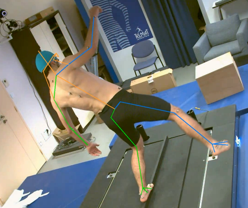

[](https://github.com/perfanalytics/pose2sim/actions/workflows/continuous-integration.yml)
[](https://badge.fury.io/py/Pose2Sim) \
[](https://pepy.tech/project/pose2sim)
[](https://opensource.org/licenses/BSD-3-Clause)
[](https://github.com/perfanalytics/pose2sim/issues)
\
[](https://joss.theoj.org/papers/a31cb207a180f7ac9838d049e3a0de26)

# Pose2Sim
`Pose2Sim` provides a workflow for 3D markerless kinematics, as an alternative to the more usual marker-based motion capture methods.\
Pose2Sim stands for "OpenPose to OpenSim", as it uses OpenPose inputs (2D keypoints coordinates obtained from multiple videos) and leads to an OpenSim result (full-body 3D joint angles). 


## Contents
1. [Installation and Demonstration](#installation-and-demonstration)
   1. [Installation](#installation)
   2. [Demonstration Part-1: Build 3D TRC file on Python](#demonstration-part-1-build-3d-trc-file-on-python)
   3. [Demonstration Part-2: Obtain 3D joint angles with OpenSim](#demonstration-part-2-obtain-3d-joint-angles-with-opensim)
2. [Use on your own data](#use-on-your-own-data)
   1. [Prepare for running on your own data](#prepare-for-running-on-your-own-data)
   2. [2D pose estimation](#2d-pose-estimation)
   3. [Cameras calibration](#cameras-calibration)
   4. [2D Tracking of person](#2d-tracking-of-person)
   5. [3D triangulation](#3d-triangulation)
   6. [3D filtering](#3d-filtering)
   7. [OpenSim kinematics](#opensim-kinematics)
3. [Utilities](#utilities)
4. [How to cite and how to contribute](#how-to-cite-and-how-to-contribute)
   1. [How to cite](#how-to-cite)
   2. [How to contribute](#how-to-contribute)

## Installation and Demonstration

### Installation
1. **Install OpenPose** (instructions [there](https://github.com/CMU-Perceptual-Computing-Lab/openpose/blob/master/doc/installation/0_index.md)). Portable demo is enough.
2. **Install OpenSim 4.x** ([there](https://simtk.org/frs/index.php?group_id=91)). Tested up to v4.4-beta.
3. ***Optional.*** *Install Anaconda or [Miniconda](https://docs.conda.io/en/latest/miniconda.html). \
   Open an Anaconda terminal and create a virtual environment with typing:*
   <pre><i>conda create -n Pose2Sim python=3.8.8 
   conda activate Pose2Sim</i></pre>
   
3. **Install Pose2Sim**: \
If you don't use Anaconda, type `python -V` in terminal to make sure python>=3.6 is installed.
   - OPTION 1: **Quick install:** Open a terminal. 
       ```
       pip install pose2sim
       ```
     
   - OPTION 2: **Build from source:**
     Open a terminal in the directory of your choice and Clone the Pose2Sim repository.
       ```
       git clone https://gitlab.inria.fr/perfanalytics/pose2sim.git
       cd pose2sim
       pip install .
       ```
          
### Demonstration Part-1: Build 3D TRC file on Python  
> _**This demonstration provides an example experiment of a person balancing on a beam, filmed with 4 calibrated cameras processed with OpenPose.**_ 

Open a terminal and check package location with `pip show pose2sim | grep Location`. \
Copy this path and go to the Demo folder with `cd <path>\pose2sim\Demo`. \
Type `python`, and test the following code:
```
from Pose2Sim import Pose2Sim
Pose2Sim.calibrateCams()
Pose2Sim.track2D()
Pose2Sim.triangulate3D()
Pose2Sim.filter3D()
```
You should obtain a plot of all the 3D coordinates trajectories. You can check the logs in`Demo\Users\logs.txt`.\
Results are stored as .trc files in the `Demo/pose-3d` directory.

*N.B.:* Default parameters have been provided in `Demo\Users\Config.toml` but can be edited.
<br/>

### Demonstration Part-2: Obtain 3D joint angles with OpenSim  
> _**In the same vein as you would do with marker-based kinematics, start with scaling your model, and then perform inverse kinematics.**_ 

#### Scaling
1. Open OpenSim.
2. Open the provided `Model_Pose2Sim_Body25b.osim` model from `pose2sim/Demo/opensim`. *(File -> Open Model)*
3. Load the provided `Scaling_Setup_Pose2Sim_Body25b.xml` scaling file from `pose2sim/Demo/opensim`. *(Tools -> Scale model -> Load)*
4. Run. You should see your skeletal model take the static pose.

#### Inverse kinematics
1. Load the provided `IK_Setup_Pose2Sim_Body25b.xml` scaling file from `pose2sim/Demo/opensim`. *(Tools -> Inverse kinematics -> Load)*
2. Run. You should see your skeletal model move in the Vizualizer window.
<br/>

## Use on your own data

> _**Deeper explanations and instructions are given below.**_

### Prepare for running on your own data
  > _**Get ready.**_
  
  1. Find your `Pose2Sim\Empty_project`, copy-paste it where you like and give it the name of your choice.
  2. Edit the `User\Config.toml` file as needed, **especially regarding the path to your project**. 
  2. Populate the `raw-2d`folder with your camera images or videos.
  
       <pre>
       Project
       │
       ├──opensim
       │    ├──Geometry
       │    ├──Model_Pose2Sim_Body25b.osim
       │    ├──Scaling_Setup_Pose2Sim_Body25b.xml
       │    └──IK_Setup_Pose2Sim_Body25b.xml
       │        
       ├── <b>raw-2d
       │    ├──raw_cam1_img
       │    ├──...
       │    └──raw_camN_img</b>
       │
       └──User
           └──Config.toml
       </b>
    
### 2D pose estimation
> _**Estimate 2D pose from images with Openpose.**_

Open a command prompt in your **OpenPose** directory. \
Launch OpenPose for each raw image folder: 
```
bin\OpenPoseDemo.exe --model_pose BODY_25B --image_dir <PATH_TO_PROJECT_DIR>\raw-2d\raw_cam1_img --write_json <PATH_TO_PROJECT_DIR>\pose-2d\pose_cam1_json
```

* *N.B.:* The [BODY_25B model](https://github.com/CMU-Perceptual-Computing-Lab/openpose_train/tree/master/experimental_models) has more accurate results; however, feel free to use any OpenPose model (BODY_25B, BODY_25, COCO, with face and/or hands, etc), and to work with videos instead of image files.
* *N.B.:* You can also use [DeepLabCut](https://github.com/DeepLabCut/DeepLabCut), or other 2D pose estimators instead. \
If you decide to do so, you'll have to (1) translate the format to json files (with `DLC_to_OpenPose.py` script, see [Utilities](#utilities)); (2) report the model keypoints in the 'skeleton.py' file; (3) create an OpenSim model if you need 3D joint angles.



N.B.: Markers are not needed and are used only for validation


<details>
  <summary>The project hierarchy becomes: (CLICK TO SHOW)</summary>
    <pre>
   Project
   │
   ├──opensim
   │    ├──Geometry
   │    ├──Model_Pose2Sim_Body25b.osim
   │    ├──Scaling_Setup_Pose2Sim_Body25b.xml
   │    └──IK_Setup_Pose2Sim_Body25b.xml
   │
   <i><b>├──pose-2d
   │    ├──pose_cam1_json
   │    ├──...
   │    └──pose_camN_json</i></b>
   │        
   ├── raw-2d
   │   ├──raw_cam1_img
   │   ├──...
   │   └──raw_camN_img
   │
   └──User
       └──Config.toml
   </pre>
</details>

### Cameras calibration
> _**Calibrate your cameras.**_

1. If you already have a calibration file (.qca.txt from Qualisys for example):
- copy it in the `calib-2d` folder
- set [calibration] type to 'qca' in your `Config.toml` file.

or

2. If you have taken pictures or videos of a checkerboard with your cameras:
- create a folder for each camera in your `calib-2d` folder,
- copy there the images or videos of the checkerboard
- set [calibration] type to 'checkerboard' in your `Config.toml` file, and adjust other parameters.

Open an Anaconda prompt or a terminal. \
By default, `calibrateCams()` will look for `Config.toml` in the `User` folder of your current directory. If you want to store it somewhere else (e.g. in your data directory), specify this path as an argument: `Pose2Sim.calibrateCams(r'path_to_config.toml')`.

```
from Pose2Sim import Pose2Sim
Pose2Sim.calibrateCams()
```

Output:\


<details>
  <summary>The project hierarchy becomes: (CLICK TO SHOW)</summary>
    <pre>
   Project
   │
   ├──<i><b>calib-2d
   │   ├──calib_cam1_img
   │   ├──...
   │   ├──calib_camN_img
   │   └──Calib.toml</i></b>
   │
   ├──opensim
   │    ├──Geometry
   │    ├──Model_Pose2Sim_Body25b.osim
   │    ├──Scaling_Setup_Pose2Sim_Body25b.xml
   │    └──IK_Setup_Pose2Sim_Body25b.xml
   │
   ├──pose-2d
   │    ├──pose_cam1_json
   │    ├──...
   │    └──pose_camN_json
   │        
   ├── raw-2d
   │   ├──raw_cam1_img
   │   ├──...
   │   └──raw_camN_img
   │
   └──User
       └──Config.toml
   </pre>
</details>

### 2D tracking of person
> _**Track the person viewed by the most cameras, in case of several detections by OpenPose.**_ \
*N.B.: Skip this step if only one person is in the field of view.*

Open an Anaconda terminal
By default, `track2D()` will look for `Config.toml` in the `User` folder of your current directory. If you want to store it somewhere else (e.g. in your data directory), specify this path as an argument: `Pose2Sim.track2D(r'path_to_config.toml')`.
```
from Pose2Sim import Pose2Sim
Pose2Sim.track2D()
```

Check printed output. If results are not satisfying, try and release the constraints in the `Config.toml` file.

Output:\


<details>
  <summary>The project hierarchy becomes: (CLICK TO SHOW)</summary>
    <pre>
   Project
   │
   ├──calib-2d
   │   ├──calib_cam1_img
   │   ├──...
   │   ├──calib_camN_img
   │   └──Calib.toml
   │
   ├──opensim
   │    ├──Geometry
   │    ├──Model_Pose2Sim_Body25b.osim
   │    ├──Scaling_Setup_Pose2Sim_Body25b.xml
   │    └──IK_Setup_Pose2Sim_Body25b.xml
   │
   ├──pose-2d
   │   ├──pose_cam1_json
   │   ├──...
   │   └──pose_camN_json
   │
   <i><b>├──pose-2d-tracked
   │   ├──tracked_cam1_json
   │   ├──...
   │   └──tracked_camN_json</i></b>
   │        
   ├── raw-2d
   │   ├──raw_cam1_img
   │   ├──...
   │   └──raw_camN_img
   │
   └──User
       └──Config.toml
   </pre>
</details>
   
### 3D triangulation
> _**Triangulate your 2D coordinates in a robust way.**_

Open an Anaconda terminal.
By default, `triangulate3D()` will look for `Config.toml` in the `User` folder of your current directory. If you want to store it somewhere else (e.g. in your data directory), specify this path as an argument: `Pose2Sim.triangulate3D(r'path_to_config.toml')`.

```
from Pose2Sim import Pose2Sim
Pose2Sim.triangulate3D()
```

Check printed output, and vizualise your trc in OpenSim.\
If your triangulation is not satisfying, try and release the constraints in the `Config.toml` file.

Output:\


<details>
  <summary>The project hierarchy becomes: (CLICK TO SHOW)</summary>
    <pre>
   Project
   │
   ├──calib-2d
   │   ├──calib_cam1_img
   │   ├──...
   │   ├──calib_camN_img
   │   └──Calib.toml
   │
   ├──opensim
   │    ├──Geometry
   │    ├──Model_Pose2Sim_Body25b.osim
   │    ├──Scaling_Setup_Pose2Sim_Body25b.xml
   │    └──IK_Setup_Pose2Sim_Body25b.xml
   │
   ├──pose-2d
   │   ├──pose_cam1_json
   │   ├──...
   │   └──pose_camN_json
   │
   ├──pose-2d-tracked
   │   ├──tracked_cam1_json
   │   ├──...
   │   └──tracked_camN_json
   │
   <i><b>├──pose-3d
       └──Pose-3d.trc</i></b>>
   │        
   ├── raw-2d
   │   ├──raw_cam1_img
   │   ├──...
   │   └──raw_camN_img
   │
   └──User
       └──Config.toml
   </pre>
</details>


### 3D Filtering
> _**Filter your 3D coordinates.**_

Open an Anaconda terminal.
By default, `filter3D()` will look for `Config.toml` in the `User` folder of your current directory. If you want to store it somewhere else (e.g. in your data directory), specify this path as an argument: `Pose2Sim.filter3D(r'path_to_config.toml')`.

```
from Pose2Sim import Pose2Sim
Pose2Sim.filter3D()
```

Check your filtration with the displayed figures, and vizualise your trc in OpenSim. If your filtering is not satisfying, try and change the parameters in the `Config.toml` file.

Output:\


<details>
  <summary>The project hierarchy becomes: (CLICK TO SHOW)</summary>
    <pre>
   Project
   │
   ├──calib-2d
   │   ├──calib_cam1_img
   │   ├──...
   │   ├──calib_camN_img
   │   └──Calib.toml
   │
   ├──opensim
   │    ├──Geometry
   │    ├──Model_Pose2Sim_Body25b.osim
   │    ├──Scaling_Setup_Pose2Sim_Body25b.xml
   │    └──IK_Setup_Pose2Sim_Body25b.xml
   │
   ├──pose-2d
   │   ├──pose_cam1_json
   │   ├──...
   │   └──pose_camN_json
   │
   ├──pose-2d-tracked
   │   ├──tracked_cam1_json
   │   ├──...
   │   └──tracked_camN_json
   │
   <i><b>├──pose-3d
   │   ├──Pose-3d.trc
   │   └──Pose-3d-filtered.trc</i></b>
   │        
   ├── raw-2d
   │   ├──raw_cam1_img
   │   ├──...
   │   └──raw_camN_img
   │
   └──User
       └──Config.toml
   </pre>
</details>


### OpenSim kinematics
> _**Obtain 3D joint angles.**_

#### Scaling
1. Use the previous steps to capture a static pose, typically an A-pose or a T-pose.
2. Open OpenSim.
3. Open the provided `Model_Pose2Sim_Body25b.osim` model from `pose2sim/Empty_project/opensim`. *(File -> Open Model)*
4. Load the provided `Scaling_Setup_Pose2Sim_Body25b.xml` scaling file from `pose2sim/Empty_project/opensim`. *(Tools -> Scale model -> Load)*
5. Replace the example static .trc file with your own data.
6. Run
7. Save the new scaled OpenSim model.

#### Inverse kinematics
1. Use Pose2Sim to generate 3D trajectories.
2. Open OpenSim.
3. Load the provided `IK_Setup_Pose2Sim_Body25b.xml` scaling file from `pose2sim/Empty_project/opensim`. *(Tools -> Inverse kinematics -> Load)*
4. Replace the example .trc file with your own data, and specify the path to your angle kinematics output file.
5. Run
6. Motion results will appear as .mot file in the `pose2sim/Empty_project/opensim` directory (automatically saved).


<figure>
<figcaption>Pose2Sim has been tested on other more or less challenging tasks and conditions.</figcaption></figure>

#### Command line
Alternatively, you can use command-line tools:
Open an Anaconda terminal in your OpenSim/bin directory, typically `C:\OpenSim <Version>\bin`.\
You'll need to adjust the `time_range`, `output_motion_file`, and the paths to the .osim and .trc files in your setup file.
```
opensim-cmd run-tool <PATH_TO_POSE2SIM>/OpenSim/Setup/<YOUR SCALING OR IK SETUP FILE>.xml
```


<details>
  <summary>The project hierarchy becomes: (CLICK TO SHOW)</summary>
    <pre>
   Project
   │
   ├──calib-2d
   │   ├──calib_cam1_img
   │   ├──...
   │   ├──calib_camN_img
   │   └──Calib.toml
   │
   ├──<i><b>opensim</i></b>  
   │    ├──Geometry
   │    ├──Model_Pose2Sim_Body25b.osim
   │    ├──Scaling_Setup_Pose2Sim_Body25b.xml
   │    ├──<i><b>Model_Pose2Sim_Body25b_Scaled.osim</i></b>  
   │    ├──IK_Setup_Pose2Sim_Body25b.xml
   │    └──<i><b>IK_result.mot</i></b>   
   │
   ├──pose-2d
   │   ├──pose_cam1_json
   │   ├──...
   │   └──pose_camN_json
   │
   ├──pose-2d-tracked
   │   ├──tracked_cam1_json
   │   ├──...
   │   └──tracked_camN_json
   │
   ├──pose-3d
   │   ├──Pose-3d.trc
   │   └──Pose-3d-filtered.trc
   │        
   ├── raw-2d
   │   ├──raw_cam1_img
   │   ├──...
   │   └──raw_camN_img
   │
   └──User
       └──Config.toml
   </pre>
</details>

## Utilities
A list of standalone tools, which can be both run as scripts or imported as functions. Check usage in the docstrings of each python file.\

<details>
  <summary><b>Converting files and Calibrating</b> (CLICK TO SHOW)</summary>
    <pre>

`DLC_to_OpenPose.py`
Converts a DeepLabCut (h5) 2D pose estimation file into OpenPose (json) files.

`c3d_to_trc.py`
Converts 3D point data of a .c3d file to a .trc file compatible with OpenSim. No analog data (force plates, emg) nor computed data (angles, powers, etc) are retrieved.

`calib_from_checkerboard.py`
Calibrates cameras with images or a video of a checkerboard, saves calibration in a Pose2Sim .toml calibration file.

`calib_qca_to_toml.py`
Converts a Qualisys .qca.txt calibration file to the Pose2Sim .toml calibration file (similar to what is used in [AniPose](https://anipose.readthedocs.io/en/latest/)).

`calib_toml_to_qca.py`
Converts a Pose2Sim .toml calibration file (e.g., from a checkerboard) to a Qualisys .qca.txt calibration file.

`calib_yml_to_toml.py`
Converts OpenCV intrinsic and extrinsic .yml calibration files to an OpenCV .toml calibration file.

`calib_toml_to_yml.py`
Converts an OpenCV .toml calibration file to OpenCV intrinsic and extrinsic .yml calibration files.
   </pre>
</details>

<details>
  <summary><b>Plotting tools</b> (CLICK TO SHOW)</summary>
    <pre>

`json_display_with_img.py` 
Overlays 2D detected json coordinates on original raw images. High confidence keypoints are green, low confidence ones are red.

`json_display_without_img.py`
Plots an animation of 2D detected json coordinates. 

`trc_plot.py`
Displays X, Y, Z coordinates of each 3D keypoint of a TRC file in a different matplotlib tab.
   </pre>
</details>

<details>
  <summary><b>Other trc tools</b> (CLICK TO SHOW)</summary>
    <pre>
    
`trc_desample.py`
Undersamples a trc file.

`trc_Zup_to_Yup.py`
Changes Z-up system coordinates to Y-up system coordinates.

`trc_filter.py`
Filters trc files. Available filters: Butterworth, Butterworth on speed, Gaussian, LOESS, Median.

`trc_gaitevents.py`
Detects gait events from point coordinates according to [Zeni et al. (2008)](https://www.sciencedirect.com/science/article/abs/pii/S0966636207001804?via%3Dihub).
   </pre>
</details>


## How to cite and how to contribute
#### How to cite
If you use this code or data, please cite [Pagnon et al., 2022](https://www.mdpi.com/1424-8220/22/7/2712) or [Pagnon et al., 2021](https://www.mdpi.com/1424-8220/21/19/6530).
    
    @Article{Pagnon_2022_Pose2Sim,
      AUTHOR = {Pagnon, David and Domalain, Mathieu and Reveret, Lionel},
      TITLE = {Pose2Sim: An End-to-End Workflow for 3D Markerless Sports Kinematics—Part 2: Accuracy},
      JOURNAL = {Sensors},
      YEAR = {2022},
      PUBLISHER = {Multidisciplinary Digital Publishing Institute},
      URL = {https://www.mdpi.com/1424-8220/22/7/2712}
    }

    @Article{Pagnon_2021_Pose2Sim,
      AUTHOR = {Pagnon, David and Domalain, Mathieu and Reveret, Lionel},
      TITLE = {Pose2Sim: An End-to-End Workflow for 3D Markerless Sports Kinematics—Part 1: Robustness},
      JOURNAL = {Sensors},
      YEAR = {2021},
      PUBLISHER = {Multidisciplinary Digital Publishing Institute},
      URL = {https://www.mdpi.com/1424-8220/21/19/6530},
    }


#### How to contribute

I would happily welcome any proposal for new features, code improvement, and more!\
If you want to contribute to Pose2Sim, please follow [this guide](https://docs.github.com/en/get-started/quickstart/contributing-to-projects) on how to fork, modify and push code, and submit a pull request. I would appreciate it if you provided as much useful information as possible about how you modified the code, and a rationale for why you're making this pull request. Please also specify on which operating system and on which python version you have tested the code.

*Here is a to-do list, for general guidance purposes only:*
> <li> Integrate as a Blender and / or Maya add-on. See <a href="https://github.com/davidpagnon/Maya-Mocap">Maya-Mocap</a> and <a href="https://github.com/JonathanCamargo/BlendOsim">BlendOSim</a>
> <li> Multiple persons kinematics (triangulating multiple persons, and sorting them in time)</li>
> <li> Use aniposelib for better calibration </li>
> <li> Finish deploying Body_135, MediaPipe, AlphaPose, and DeepLabCut compatibility </li>
> </br>
> <li> Conda package and Docker image</li>
> <li> Solve limb swapping</li>
> <li> Implement normalized DLT and RANSAC triangulation, as well as a triangulation refinement step (cf DOI:10.1109/TMM.2022.3171102)</li>
> <li> Implement optimal fixed-interval Kalman smoothing</li>
> <li> Utilities: convert Vicon xcp calibration file to toml</li>
> <li> Run from command line via click or typer</li>
> <li> Catch errors</li>
> <li> Make GUI</li>


