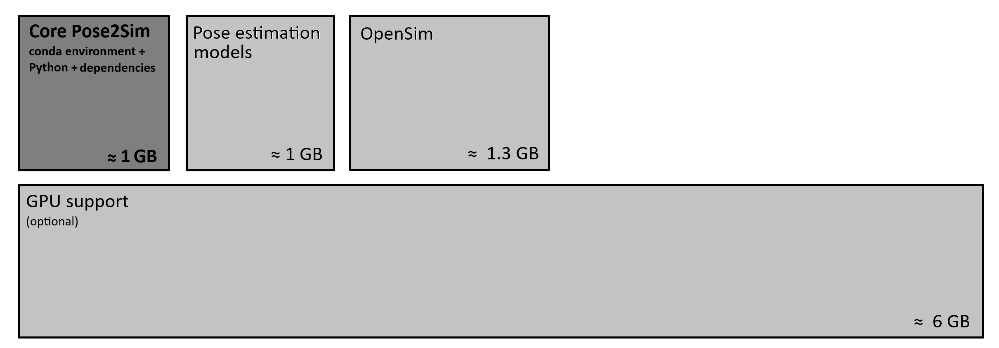

[](https://github.com/perfanalytics/pose2sim/actions/workflows/continuous-integration.yml)
[](https://badge.fury.io/py/Pose2Sim) \
[](https://pepy.tech/project/pose2sim)
[](https://github.com/perfanalytics/pose2sim/stargazers)
[](https://GitHub.com/perfanalytics/pose2sim/forks)
[](https://github.com/perfanalytics/pose2sim/issues)
[](https://GitHub.com/perfanalytics/pose2sim/issues?q=is%3Aissue+is%3Aclosed)
\
[](https://joss.theoj.org/papers/a31cb207a180f7ac9838d049e3a0de26)
[](https://zenodo.org/doi/10.5281/zenodo.10658947)
[](https://opensource.org/licenses/BSD-3-Clause)
\
[](https://discord.com/invite/4mXUdSFjmt)


# Pose2Sim


##### N.B:. Please set undistort_points and handle_LR_swap to false for now since it currently leads to inaccuracies. I'll try to fix it soon.

> **_News_: Version 0.10.0:**\
> **OpenSim scaling and inverse kinematics are now integrated in Pose2Sim!** No static trial needed.\
> **Other recently added features**: Pose estimation, Automatic camera synchronization, Multi-person analysis, Blender visualization and rig, Marker augmentation, Batch processing.
<!-- Incidentally, right/left limb swapping is now handled, which is useful if few cameras are used;\
and lens distortions are better taken into account.\ -->
> To upgrade, type `pip install pose2sim --upgrade`

<!-- GitHub Star Button -->
<!-- 
<a class="github-button" href="https://github.com/perfanalytics/pose2sim" data-color-scheme="no-preference: light; light: light; dark: dark;" data-icon="octicon-star" data-show-count="true" aria-label="Star perfanalytics/pose2sim on GitHub">Star</a>
<script async defer src="https://buttons.github.io/buttons.js"></script>
-->

<br>

`Pose2Sim` provides a workflow for 3D markerless kinematics (human or animal), as an alternative to traditional marker-based MoCap methods. 

**Pose2Sim** is free and open-source, low-cost but with research-grade accuracy and production-grade robustness. It gives a maximum of control on clearly explained parameters. Any combination of phones, webcams, or GoPros can be used with fully clothed subjects, so it is particularly adapted to the sports field, the doctor's office, or for outdoor 3D animation capture.

***Note:*** For real-time analysis with a single camera, please consider **[Sports2D](https://github.com/davidpagnon/Sports2D)** (note that the motion must lie in the sagittal or frontal plane). 

<br>

*Fun fact:*\
Pose2Sim stands for "OpenPose to OpenSim", as it originally used *OpenPose* inputs (2D keypoints coordinates) and lead to an OpenSim result (full-body 3D joint angles). Pose estimation is now performed with more recent models from [RTMPose](https://github.com/open-mmlab/mmpose/tree/main/projects/rtmpose), and custom models (from [DeepLabCut](https://www.mackenziemathislab.org/deeplabcut) for example) can also be used. 


</br>

**Pose2Sim releases:**
- [x] **v0.1** *(08/2021)*: Published paper
- [x] **v0.2** *(01/2022)*: Published code
- [x] **v0.3** *(01/2023)*: Supported other pose estimation algorithms
- [x] **v0.4** *(07/2023)*: New calibration tool based on scene measurements
- [x] **v0.5** *(12/2023)*: Automatic batch processing
- [x] **v0.6** *(02/2024)*: Marker augmentation, Blender visualizer
- [x] **v0.7** *(03/2024)*: Multi-person analysis
- [x] **v0.8** *(04/2024)*: New synchronization tool
- [x] **v0.9** *(07/2024)*: Integration of pose estimation in the pipeline
- [x] **v0.10 *(09/2024)*: Integration of OpenSim in the pipeline**
- [ ] v0.11: Integration of Sports2D, monocular 3D pose estimation, and documentation on new website
- [ ] v0.12: Graphical User Interface
- [ ] v0.13: Calibration based on keypoint detection, Handling left/right swaps, Correcting lens distortions
- [ ] v1.0: First full release

***N.B.:*** As always, I am more than happy to welcome contributors (see [How to contribute](#how-to-contribute)).

</br>

# Contents
1. [Installation and Demonstration](#installation-and-demonstration)
   1. [Installation](#installation)
   2. [Demonstration Part-1: End to end video to 3D joint angle computation](#demonstration-part-1-end-to-end-video-to-3d-joint-angle-computation)
   3. [Demonstration Part-2: Visualize your results with OpenSim or Blender](#demonstration-part-2-visualize-your-results-with-opensim-or-blender)
   4. [Demonstration Part-3: Try multi-person analysis](#demonstration-part-3-try-multi-person-analysis)
   5. [Demonstration Part-4: Try batch processing](#demonstration-part-4-try-batch-processing)
2. [Use on your own data](#use-on-your-own-data)
   1. [Setting up your project](#setting-up-your-project)
   2. [2D pose estimation](#2d-pose-estimation)
      1. [With RTMPose (default)](#with-rtmpose-default)
      2. [With MMPose (coming soon)](#with-mmpose-coming-soon)
      3. [With DeepLabCut](#with-deeplabcut)
      4. [With OpenPose (legacy)](#with-openpose-legacy)
      5. [With Mediapipe BlazePose (legacy)](#with-mediapipe-blazepose-legacy)
      6. [With AlphaPose (legacy)](#with-alphapose-legacy)
   4. [Camera calibration](#camera-calibration)
      1. [Convert from Caliscope, AniPose, FreeMocap, Qualisys, Optitrack, Vicon, OpenCap, EasyMocap, or bioCV](#convert-from-caliscope-anipose-freemocap-qualisys-optitrack-vicon-opencap-easymocap-or-biocv)
      2. [Calculate from scratch](#calculate-from-scratch)
   5. [Synchronizing, Associating, Triangulating, Filtering](#synchronizing-associating-triangulating-filtering)
      1. [Synchronization](#synchronization)
      2. [Associate persons across cameras](#associate-persons-across-cameras)
      3. [Triangulating keypoints](#triangulating-keypoints)
      4. [Filtering 3D coordinates](#filtering-3d-coordinates)
      5. [Marker augmentation](#marker-augmentation)
   6. [OpenSim kinematics](#opensim-kinematics)
      1. [Within Pose2Sim](#within-pose2sim)
      2. [Within OpenSim GUI](#within-opensim-gui)
      3. [Command Line](#command-line)
3. [Utilities](#utilities)
4. [How to cite and how to contribute](#how-to-cite-and-how-to-contribute)
   1. [How to cite](#how-to-cite)
   2. [How to contribute and to-do list](#how-to-contribute-and-to-do-list)

</br>

# Installation and Demonstration

## Installation

1. ***Optional:***\
*Install Anaconda or [Miniconda](https://docs.conda.io/en/latest/miniconda.html) for simplicity and avoiding the risk of incompatibilities between libraries.*

   Once installed, open an Anaconda prompt and create a virtual environment:
   ```
   conda create -n Pose2Sim python=3.10 -y 
   conda activate Pose2Sim
   ```

2. **Install OpenSim**:\
Install the OpenSim Python API (if you do not want to install via conda, refer [to this page](https://opensimconfluence.atlassian.net/wiki/spaces/OpenSim/pages/53085346/Scripting+in+Python#ScriptinginPython-SettingupyourPythonscriptingenvironment(ifnotusingconda))):
   ```
   conda install -c opensim-org opensim -y
   ```
   
3. **Install Pose2Sim**:\
If you don't use Anaconda, type `python -V` in terminal to make sure python>=3.10 is installed. 
   - OPTION 1: **Quick install:** Open a terminal. 
       ``` cmd
       pip install pose2sim
       ```
     
   - OPTION 2: **Build from source and test the last changes:**
     Open a terminal in the directory of your choice and Clone the Pose2Sim repository.
       ``` cmd
       git clone --depth 1 https://github.com/perfanalytics/pose2sim.git
       cd pose2sim
       pip install .
       ```

4. ***Optional:***\
   *For faster inference, you can run on the GPU. Install pyTorch with CUDA and cuDNN support, and ONNX Runtime with GPU support (not available on MacOS).*\
   Be aware that GPU support takes an additional 6 GB on disk. The full installation is then 10.75 GB instead of 4.75 GB.
   
   Run `nvidia-smi` in a terminal. If this results in an error, your GPU is probably not compatible with CUDA. If not, note the "CUDA version": it is the latest version your driver is compatible with (more information [on this post](https://stackoverflow.com/questions/60987997/why-torch-cuda-is-available-returns-false-even-after-installing-pytorch-with)).

   Then go to the [ONNXruntime requirement page](https://onnxruntime.ai/docs/execution-providers/CUDA-ExecutionProvider.html#requirements), note the latest compatible CUDA and cuDNN requirements. Next, go to the [pyTorch website](https://pytorch.org/get-started/previous-versions/) and install the latest version that satisfies these requirements (beware that torch 2.4 ships with cuDNN 9, while torch 2.3 installs cuDNN 8). For example:
   ``` cmd
   pip3 install torch torchvision torchaudio --index-url https://download.pytorch.org/whl/cu124
   ```

   Finally, install ONNX Runtime with GPU support:
   ```
   pip uninstall onnxruntime
   pip install onnxruntime-gpu
   ```

   Check that everything went well within Python with these commands:
   ``` python
   import torch; import onnxruntime as ort
   print(torch.cuda.is_available(), ort.get_available_providers())
   # Should print "True ['CUDAExecutionProvider', ...]"
   ```  

  <!-- print(f'torch version: {torch.__version__}, cuda version: {torch.version.cuda}, cudnn version: {torch.backends.cudnn.version()}, onnxruntime version: {ort.__version__}') -->

> **Note on storage use:**\
     A full installation takes up to 10 GB of storage spate. However, GPU support is not mandatory and takes about 6 GB. A minimal installation with carefully chosen pose models and without GPU support **would take less than 3 GB**.\
    


</br>

## Demonstration Part-1: End to end video to 3D joint angle computation
> _**This demonstration provides an example experiment of a person balancing on a beam, filmed with 4 cameras.**_ 

Open a terminal, enter `pip show pose2sim`, report package location. \
Copy this path and go to the Single participant Demo folder: `cd <path>\Pose2Sim\Demo_SinglePerson`. \
Type `ipython`, and try the following code:
``` python
from Pose2Sim import Pose2Sim
Pose2Sim.calibration()
Pose2Sim.poseEstimation()
Pose2Sim.synchronization()
Pose2Sim.personAssociation()
Pose2Sim.triangulation()
Pose2Sim.filtering()
Pose2Sim.markerAugmentation()
Pose2Sim.kinematics()
```
**3D marker locations** are stored as .trc files in each trial folder in the `pose-3d` directory.\
**3D joint angles** are stored as .mot files in the `kinematics` directory. Scaled models are also stored in the same directory.

</br>

**Note:** 
- Default parameters have been provided in [Config.toml](https://github.com/perfanalytics/pose2sim/blob/main/Pose2Sim/Demo_SinglePerson/Config.toml) but can be edited.\
All of them are clearly documented: feel free to play with them!
- You can run all stages at once: 
  ``` python
  from Pose2Sim import Pose2Sim
  Pose2Sim.runAll()
  # or: Pose2Sim.runAll(do_calibration=True, do_poseEstimation=True, do_synchronization=True, do_personAssociation=True, do_triangulation=True, do_filtering=True, do_markerAugmentation=True, do_kinematics=True)
  ```
- Try the calibration tool by changing `calibration_type` to `calculate` instead of `convert` in [Config.toml](https://github.com/perfanalytics/pose2sim/blob/main/Pose2Sim/Demo_SinglePerson/Config.toml) (more info [there](#calculate-from-scratch)).
- Note that **Pose2Sim.markerAugmentation()** does not necessarily improve results--*in fact, results are worse half of the time.* You can choose to not run this command, and save an additional 1.3 GB by uninstalling tensorflow: `pip uninstall tensorflow`.

</br>

## Demonstration Part-2: Visualize your results with OpenSim or Blender
> _**Visualize your results and look in detail for potential areas of improvement.**_ 

### Basic visualization with the OpenSim GUI


- Install OpenSim GUI:\
  Download the executable [there](https://simtk.org/projects/opensim).
- Visualize results:
  - Open the OpenSim GUI, go to File > Open Model, and select the scaled model in the `kinematics` folder.
  - Go to File > Load Motion, and load the joint angle .mot file in the `kinematics` folder.
  - If you want to see the 3D marker locations, go to File > Preview Experimental Data, and load the .trc file in the `pose-3d` folder.

  

<br>

### Further check with the Pose2Sim Blender add-on

- **Install the add-on:**\
  Follow instructions on the [Pose2Sim_Blender](https://github.com/davidpagnon/Pose2Sim_Blender) add-on page.

- **Visualize results:**\
  Just play with the buttons!\
  Visualize camera positions, videos, triangulated keypoints, OpenSim skeleton, video overlay your results on videos, ... or let your creativity flow and create your own animations!

  https://github.com/davidpagnon/Pose2Sim_Blender/assets/54667644/a2cfb75d-a2d4-471a-b6f8-8f1ee999a619
  
  **N.B.:** Full install only required to import the skeleton. See instructions [there](https://github.com/davidpagnon/Pose2Sim_Blender?tab=readme-ov-file#full-install).

<br/>

## Demonstration Part-3: Try multi-person analysis
> _**Another person, hidden all along, will appear when multi-person analysis is activated!**_

Go to the Multi-participant Demo folder: `cd <path>\Pose2Sim\Demo_MultiPerson`. \
Make sure that `multi_person = true` is set in your [Config.toml](https://github.com/perfanalytics/pose2sim/blob/main/Pose2Sim/Demo_MultiPerson/Config.toml) file.\
Type `ipython`, and try the following code:

``` python
from Pose2Sim import Pose2Sim
Pose2Sim.calibration()
Pose2Sim.poseEstimation()
Pose2Sim.synchronization()
Pose2Sim.personAssociation()
Pose2Sim.triangulation()
Pose2Sim.filtering()
Pose2Sim.markerAugmentation()
Pose2Sim.kinematics()
```

or equivalently:

``` python
from Pose2Sim import Pose2Sim
Pose2Sim.runAll() 
```

One .trc file per participant will be generated and stored in the `pose-3d` directory.\
Similarly, one scaled .osim model and one joint angle .mot file per participant will be stored in the `kinematics`folder.

You can visualize your results with Blender as explained in [Demonstration Part-2](#demonstration-part-2-visualize-your-results-with-opensim-or-blender).

<br>

***N.B.:***
- Make sure that the order of `markerAugmentation` > `participant_height` and `participant_mass` matches the person's IDs.

<br/>

## Demonstration Part-4: Try batch processing
> _**Run numerous analysis with different parameters and minimal friction.**_

Go to the Batch Demo folder: `cd <path>\Pose2Sim\Demo_Batch`. \
Type `ipython`, and try the following code:

``` python
from Pose2Sim import Pose2Sim
Pose2Sim.calibration()
Pose2Sim.poseEstimation()
Pose2Sim.synchronization()
Pose2Sim.personAssociation()
Pose2Sim.triangulation()
Pose2Sim.filtering()
Pose2Sim.markerAugmentation()
Pose2Sim.kinematics()
```

or equivalently:

``` python
from Pose2Sim import Pose2Sim
Pose2Sim.runAll()
```

The batch processing structure requires a `Config.toml` file in each of the trial directories. Global parameters are given in the `Config.toml` file of the `BatchSession` folder. They can be altered for specific Trials by uncommenting keys and their values in their respective `Config.toml` files.

Run Pose2Sim from the `BatchSession` folder if you want to batch process the whole session, or from a `Trial` folder if you want to process only a specific trial. 


| SingleTrial     | BatchSession       |
|-----------------|--------------------|
| <pre><b>SingleTrial</b>                    <br>├── <b>calibration</b><br>├── <b>videos</b><br>└── <i><b>Config.toml</i></b></pre> |  <pre><b>BatchSession</b>                     <br>├── <b>calibration</b> <br>├── Trial_1 <br>│   ├── <b>videos</b> <br>│   └── <i><b>Config.toml</i></b><br>├── Trial_2 <br>│   ├── <b>videos</b> <br>│   └── <i><b>Config.toml</i></b><br>└── <i><b>Config.toml</i></b></pre>  | 


For example, try uncommenting `[project]` and set `frame_range = [10,99]`, or uncomment `[pose]` and set `mode = 'lightweight'` in the `Config.toml` file of `Trial_2`.


</br></br>

# Use on your own data

> **N.B.: If a step is not relevant for your use case (synchronization, person association, marker augmentation...), you can just skip it.**

## Setting up your project
  > _**Get yourself comfy!**_
  
  1. Open a terminal, enter `pip show pose2sim`, report package location. \
     Copy this path and do `cd <path>\pose2sim`.
  2. Copy-paste the *Demo_SinglePerson*, *Demo_MultiPerson*, or *Demo_Batch* folder wherever you like, and rename it as you wish. 
  3. The rest of the tutorial will explain to you how to populate the `Calibration` and `videos` folders, edit the [Config.toml](https://github.com/perfanalytics/pose2sim/blob/main/Pose2Sim/Demo_SinglePerson/Config.toml) files, and run each Pose2Sim step.

</br>

## 2D pose estimation
> _**Estimate 2D pose from images with RTMPose or another pose estimation solution.**_ 

### With RTMPose *(default)*:
> [RTMPose](https://github.com/open-mmlab/mmpose/tree/main/projects/rtmpose) is a state-of-the-art pose estimation solution that is faster and more accurate than OpenPose. It is now included in Pose2Sim for straightforward end-to-end analysis.

Open an Anaconda prompt or a terminal in a `Session` or `Trial` folder.\
Type `ipython`.

``` python
from Pose2Sim import Pose2Sim
Pose2Sim.poseEstimation()
```


</br>

***N.B.:* To analyse wrist motion:**\
'Whole_body_wrist' or 'Whole_body' `pose_model` is required in [Config.toml](https://github.com/perfanalytics/pose2sim/blob/main/Pose2Sim/Demo_SinglePerson/Config.toml). Note that these are slower and slightly less accurate than the default 'Body_with_feet' model on body keypoints. 

<br>

***N.B.:* To speed up the process:**
- Disable `display_detection` and `save_video` 
- Increase the value of `det_frequency`. In this case, the detection is only done every `det_frequency` frames, and bounding boxes are tracked inbetween (keypoint detection is still performed on all frames)
- Use your GPU (See [Installation](#installation)). Slightly more involved, but often worth it. Note that the optimal device _(CPU or GPU)_ and backend for your configuration will be automatically selected, but you can also manually select them in Config.toml.
- Run pose estimation in `lightweight` mode instead of `balanced` or `performance`. However, this will reduce the quality of results. 
- Use `tracking_mode = 'sports2d'`: Will use the default Sports2D tracker. Unlike DeepSort, it is faster, does not require any parametrization, and is as good in non-crowded scenes. 

<br>

***N.B.:* To use custom detection and pose models:**
- Other than 'lightweight', 'balanced', or 'performance' modes, you can use any other pose estimation models through [RTMLib](https://github.com/Tau-J/rtmlib) (hand, face, animal, or any custom trained models).
- The (optional) detection model, pose model, and input sizes can be written in a dictionary (**within triple quotes**) as shown below. Models can be local paths or URLs, with .onnx or .zip extensions. Make sure the input_sizes are **within square brackets**. 

  ```
  # Equivalent to mode='balanced', with body_with_feet pose model
  mode = """{'det_class':'YOLOX',
         'det_model':'https://download.openmmlab.com/mmpose/v1/projects/rtmposev1/onnx_sdk/yolox_m_8xb8-300e_humanart-c2c7a14a.zip',
         'det_input_size':[640, 640],
         'pose_class':'RTMPose',
         'pose_model':'https://download.openmmlab.com/mmpose/v1/projects/rtmposev1/onnx_sdk/rtmpose-m_simcc-body7_pt-body7-halpe26_700e-256x192-4d3e73dd_20230605.zip',
         'pose_input_size':[192,256]}"""

  # With one-stage RTMO model 
  # Requires pose_model = 'Body'. Marker augmentation won't work, Kinematic analysis will
  mode = """{'pose_class':'RTMO', 
         'pose_model':'https://download.openmmlab.com/mmpose/v1/projects/rtmo/onnx_sdk/rtmo-m_16xb16-600e_body7-640x640-39e78cc4_20231211.zip', 
         'pose_input_size':[640, 640]}"""

  # With animal pose estimation:
  # Marker augmentation won't work, and you will need to create your own OpenSim skeleton for kinematic analysis.
  mode = """{'pose_class':'RTMPose',
         'pose_model':'https://download.openmmlab.com/mmpose/v1/projects/rtmposev1/onnx_sdk/rtmpose-m_simcc-ap10k_pt-aic-coco_210e-256x256-7a041aa1_20230206.zip',
         'pose_input_size':[256,256]}"""

  # Same approach for hand or face pose estimation, check the RTMLib documentation for more information.
  ```


</br>

### With MMPose *(coming soon)*:

> Coming soon

</br>

### With DeepLabCut:
> If you need to detect specific points on a human being, an animal, or an object, you can also train your own model with [DeepLabCut](https://github.com/DeepLabCut/DeepLabCut). In this case, Pose2Sim is used as an alternative to [AniPose](https://github.com/lambdaloop/anipose).
1. Train your DeepLabCut model and run it on your images or videos (more instruction on their repository)
2. Translate the h5 2D coordinates to json files (with `DLC_to_OpenPose.py` script, see [Utilities](#utilities)). Note that the names of your camera folders must follow the same order as in the calibration file, and end with '_json': 
   ``` cmd
   DLC_to_OpenPose -i input_h5_file
   ```
3. Edit `pose.CUSTOM` in [Config.toml](https://github.com/perfanalytics/pose2sim/blob/main/Pose2Sim/Demo_SinglePerson/Config.toml), and edit the node IDs so that they correspond to the column numbers of the 2D pose file, starting from zero. Make sure you also changed the `pose_model` and the `tracked_keypoint`.\
   You can visualize your skeleton's hierarchy by changing pose_model to CUSTOM and writing these lines: 
   ``` python
    config_path = r'path_to_Config.toml'
    import toml, anytree
    config = toml.load(config_path)
    pose_model = config.get('pose').get('pose_model')
    model = anytree.importer.DictImporter().import_(config.get('pose').get(pose_model))
    for pre, _, node in anytree.RenderTree(model): 
        print(f'{pre}{node.name} id={node.id}')
   ```
4. Create an OpenSim model if you need inverse kinematics.

### With OpenPose *(legacy)*:
> **N.B.: RTMlib is faster, more accurate, and easier to install than OpenPose. This is a legacy option.**\
> N.B.: OpenPose model files are apparently not available on their website anymore. Send me an email at dp2032@bath.ac.uk if you want me to forward them to you!

The accuracy and robustness of Pose2Sim have been thoroughly assessed only with OpenPose, BODY_25B model. Consequently, we recommend using this 2D pose estimation solution. See [OpenPose repository](https://github.com/CMU-Perceptual-Computing-Lab/openpose) for installation and running. *Windows portable demo is enough.*

* Open a command prompt in your **OpenPose** directory. \
  Launch OpenPose for each `videos` folder: 
  ``` cmd
  bin\OpenPoseDemo.exe --model_pose BODY_25B --video <PATH_TO_TRIAL_DIR>\videos\cam01.mp4 --write_json <PATH_TO_TRIAL_DIR>\pose\pose_cam01_json
  ```
* The [BODY_25B model](https://github.com/CMU-Perceptual-Computing-Lab/openpose_train/tree/master/experimental_models) has more accurate results than the standard BODY_25 one and has been extensively tested for Pose2Sim. \
You can also use the [BODY_135 model](https://github.com/CMU-Perceptual-Computing-Lab/openpose_train/tree/master/experimental_models), which allows for the evaluation of pronation/supination, wrist flexion, and wrist deviation.\
All other OpenPose models (BODY_25, COCO, MPII) are also supported.\
Make sure you modify the [Config.toml](https://github.com/perfanalytics/pose2sim/blob/main/Pose2Sim/Demo_SinglePerson/Config.toml) file accordingly.
* Use one of the `json_display_with_img.py` or `json_display_with_img.py` scripts (see [Utilities](#utilities)) if you want to display 2D pose detections.

### With MediaPipe BlazePose *(legacy)*:
> **N.B.: RTMlib is faster, more accurate, and easier to install than BlazePose. This is also a legacy option.**

[Mediapipe BlazePose](https://google.github.io/mediapipe/solutions/pose.html) is very fast, fully runs under Python, handles upside-down postures and wrist movements (but no subtalar ankle angles). \
However, it is less robust and accurate than OpenPose, and can only detect a single person.
* Use the script `Blazepose_runsave.py` (see [Utilities](#utilities)) to run BlazePose under Python, and store the detected coordinates in OpenPose (json) or DeepLabCut (h5 or csv) format: 
  ``` cmd
  Blazepose_runsave -i input_file -dJs
  ```
  Type in `Blazepose_runsave -h` for explanation on parameters.
* Make sure you changed the `pose_model` and the `tracked_keypoint` in the [Config.toml](https://github.com/perfanalytics/pose2sim/blob/main/Pose2Sim/Demo_SinglePerson/Config.toml) file.

### With AlphaPose *(legacy)*:
> **N.B.: RTMlib is faster, more accurate, and easier to install than AlphaPose. This is also a legacy option.**

[AlphaPose](https://github.com/MVIG-SJTU/AlphaPose) is one of the main competitors of OpenPose, and its accuracy is comparable. As a top-down approach (unlike OpenPose which is bottom-up), it is faster on single-person detection, but slower on multi-person detection.\
All AlphaPose models are supported (HALPE_26, HALPE_68, HALPE_136, COCO_133, COCO, MPII). For COCO and MPII, AlphaPose must be run with the flag "--format cmu".
* Install and run AlphaPose on your videos (more instruction on their repository)
* Translate the AlphaPose single json file to OpenPose frame-by-frame files (with `AlphaPose_to_OpenPose.py` script, see [Utilities](#utilities)): 
   ``` cmd
   AlphaPose_to_OpenPose -i input_alphapose_json_file
   ```
* Make sure you changed the `pose_model` and the `tracked_keypoint` in the [Config.toml](https://github.com/perfanalytics/pose2sim/blob/main/Pose2Sim/Demo_SinglePerson/Config.toml) file.

</br>

## Camera calibration
> _**Calculate camera intrinsic properties and extrinsic locations and positions.\
> Convert a preexisting calibration file, or calculate intrinsic and extrinsic parameters from scratch.**_

Open an Anaconda prompt or a terminal in a `Session` or `Trial` folder.\
Type `ipython`.


``` python
from Pose2Sim import Pose2Sim
Pose2Sim.calibration()
```


</br>
Output file:


### Convert from Caliscope, AniPose, FreeMocap, Qualisys, Optitrack, Vicon, OpenCap, EasyMocap, or bioCV

If you already have a calibration file, set `calibration_type` type to `convert` in your [Config.toml](https://github.com/perfanalytics/pose2sim/blob/main/Pose2Sim/Demo_SinglePerson/Config.toml) file.\
***N.B.:** If the original calibration file does not provide any residual errors, they will be logged as NaN. This is not an error and can be ignored.*
- **From [Caliscope](https://mprib.github.io/caliscope/), [AniPose](https://github.com/lambdaloop/anipose) or [FreeMocap](https://github.com/freemocap/freemocap):**  
  - Copy your `.toml` calibration file to the Pose2Sim `Calibration` folder.
  - Calibration can be skipped since these formats are natively supported by Pose2Sim.
- **From [Qualisys](https://www.qualisys.com):**
  - Export calibration to `.qca.txt` within QTM (see [there](https://github.com/perfanalytics/pose2sim/issues/56#issuecomment-1855933754)).
  - Copy it in the `Calibration` Pose2Sim folder.
  - set `convert_from` to 'qualisys' in your [Config.toml](https://github.com/perfanalytics/pose2sim/blob/main/Pose2Sim/Demo_SinglePerson/Config.toml) file. Change `binning_factor` to 2 if you film in 540p.
  - If you set your cameras vertically and the videos are rendered sideways, you need to rotate them and the calibration file before running pose estimation. [Use this script](https://github.com/perfanalytics/pose2sim/issues/136#issuecomment-2398110061).
- **From [Optitrack](https://optitrack.com/):** Exporting calibration will be available in Motive 3.2. In the meantime:
  - Calculate intrinsics with a board (see next section).
  - Use their C++ API [to retrieve extrinsic properties](https://docs.optitrack.com/developer-tools/motive-api/motive-api-function-reference#tt_cameraxlocation). Translation can be copied as is in your `Calib.toml` file, but TT_CameraOrientationMatrix first needs to be [converted to a Rodrigues vector](https://docs.opencv.org/3.4/d9/d0c/group__calib3d.html#ga61585db663d9da06b68e70cfbf6a1eac) with OpenCV. See instructions [here](https://github.com/perfanalytics/pose2sim/issues/28).
  - Use the `Calib.toml` file as is and do not run Pose2Sim.calibration()
- **From [Vicon](http://www.vicon.com/Software/Nexus):**  
  - Copy your `.xcp` Vicon calibration file to the Pose2Sim `Calibration` folder.
  - set `convert_from` to 'vicon' in your [Config.toml](https://github.com/perfanalytics/pose2sim/blob/main/Pose2Sim/Demo_SinglePerson/Config.toml) file. No other setting is needed.
- **From [OpenCap](https://www.opencap.ai/):**  
  - Copy your `.pickle` OpenCap calibration files to the Pose2Sim `Calibration` folder.
  - set `convert_from` to 'opencap' in your [Config.toml](https://github.com/perfanalytics/pose2sim/blob/main/Pose2Sim/Demo_SinglePerson/Config.toml) file. No other setting is needed.
- **From [EasyMocap](https://github.com/zju3dv/EasyMocap/):**  
  - Copy your `intri.yml` and `extri.yml` files to the Pose2Sim `Calibration` folder.
  - set `convert_from` to 'easymocap' in your [Config.toml](https://github.com/perfanalytics/pose2sim/blob/main/Pose2Sim/Demo_SinglePerson/Config.toml) file. No other setting is needed.
- **From [bioCV](https://github.com/camera-mc-dev/.github/blob/main/profile/mocapPipe.md):**  
  - Copy your bioCV calibration files (no extension) to the Pose2Sim `Calibration` folder.
  - set `convert_from` to 'biocv' in your [Config.toml](https://github.com/perfanalytics/pose2sim/blob/main/Pose2Sim/Demo_SinglePerson/Config.toml) file. No other setting is needed.


</br>

### Calculate from scratch

> _**Calculate calibration parameters with a checkerboard, with measurements on the scene, or automatically with detected keypoints.**_\
> Take heart, it is not that complicated once you get the hang of it!

  > *N.B.:* Try the calibration tool on the Demo by changing `calibration_type` to `calculate` in [Config.toml](https://github.com/perfanalytics/pose2sim/blob/main/Pose2Sim/Demo_SinglePerson/Config.toml).\
  For the sake of practicality, there are voluntarily few board images for intrinsic calibration, and few points to click for extrinsic calibration. In spite of this, your reprojection error should be under 1-2 cm, which [does not hinder the quality of kinematic results in practice](https://www.mdpi.com/1424-8220/21/19/6530/htm#:~:text=Angle%20results%20were,Table%203).).
  
  - **Calculate intrinsic parameters with a checkerboard:**

    > *N.B.:* _Intrinsic parameters:_ camera properties (focal length, optical center, distortion), usually need to be calculated only once in their lifetime. In theory, cameras with same model and same settings will have identical intrinsic parameters.\
    > *N.B.:* If you already calculated intrinsic parameters earlier, you can skip this step by setting `overwrite_intrinsics` to false.

    - Create a folder for each camera in your `Calibration\intrinsics` folder.
    - For each camera, film a checkerboard or a charucoboard. Either the board or the camera can be moved.
    - Adjust parameters in the [Config.toml](https://github.com/perfanalytics/pose2sim/blob/main/Pose2Sim/Demo_SinglePerson/Config.toml) file.
    - Make sure that the board:
      - is filmed from different angles, covers a large part of the video frame, and is in focus.
      - is flat, without reflections, surrounded by a wide white border, and is not rotationally invariant (Nrows ≠ Ncols, and Nrows odd if Ncols even). Go to [calib.io](https://calib.io/pages/camera-calibration-pattern-generator) to generate a suitable checkerboard.
    - A common error is to specify the external, instead of the internal number of corners (one less than the count from calib.io). This may be one less than you would intuitively think. 
    
    

    ***Intrinsic calibration error should be below 0.5 px.***
        
- **Calculate extrinsic parameters:** 

  > *N.B.:* _Extrinsic parameters:_ camera placement in space (position and orientation), need to be calculated every time a camera is moved. Can be calculated from a board, or from points in the scene with known coordinates.\
  > *N.B.:* If there is no measurable item in the scene, you can temporarily bring something in (a table, for example), perform calibration, and then remove it before you start capturing motion.

  - Create a folder for each camera in your `Calibration\extrinsics` folder.
  - Once your cameras are in place, shortly film either a board laid on the floor, or the raw scene\
  (only one frame is needed, but do not just take a photo unless you are sure it does not change the image format).
  - Adjust parameters in the [Config.toml](https://github.com/perfanalytics/pose2sim/blob/main/Pose2Sim/Demo_SinglePerson/Config.toml) file.
  - Then,
    - **With a checkerboard:**\
      Make sure that it is seen by all cameras. \
      It should preferably be larger than the one used for intrinsics, as results will not be very accurate out of the covered zone.
    - **With scene measurements** (more flexible and potentially more accurate if points are spread out):\
      Manually measure the 3D coordinates of 10 or more points in the scene (tiles, lines on wall, boxes, treadmill dimensions...). These points should be as spread out as possible. Replace `object_coords_3d` by these coordinates in Config.toml.\
      Then you will click on the corresponding image points for each view.
    - **With keypoints:**\
      For a more automatic calibration, OpenPose keypoints could also be used for calibration.\
      **COMING SOON!**

  
  
  ***Extrinsic calibration error should be below 1 cm, but depending on your application, results will still be potentially acceptable up to 2.5 cm.***

</br>


## Synchronizing, Associating, Triangulating, Filtering

### Synchronization

> _**2D points can be triangulated only if they represent the same body position across all cameras: therefore, views need to be synchronized. This module helps you do it.**_\
For each camera, the algorithm computes mean vertical speed for the chosen keypoints, and synchronizes by finding the time offset for which the correlation is highest.

>***N.B.:** Skip this step if your cameras are natively synchronized.*

Open an Anaconda prompt or a terminal in a `Session` or `Trial` folder.\
Type `ipython`.

``` python
from Pose2Sim import Pose2Sim
Pose2Sim.synchronization()
```


<br> 

You can choose the keypoints to synchronize on, the reference person, and the time when the vertical speed is the highest. You can either tune these parameters in the GUI (set `synchronization_gui = true`) or set them in your [Config.toml](https://github.com/perfanalytics/pose2sim/blob/main/Pose2Sim/Demo_SinglePerson/Config.toml) file.


*N.B.:* Works best when:
- the participant does not move towards or away from the cameras
- they perform a clear vertical movement
- the capture lasts at least 5 seconds, so that there is enough data to synchronize on
- the capture lasts a few minutes maximum, so that cameras are less likely to [drift with time](https://github.com/mprib/caliscope/discussions/496)

*N.B.:* Alternatively, synchronize cameras using a flashlight, a clap, or a clear event. GoPro cameras can also be synchronized with a timecode, by GPS (outdoors), or with their app (slightly less reliable).

</br>

### Associate persons across cameras

> _**If `multi_person` is set to `false`, the algorithm chooses the person for whom the reprojection error is smallest.\
  If `multi_person` is set to `true`, it associates across views the people for whom the distances between epipolar lines are the smallest. People are then associated across frames according to their displacement speed.**_ 

> ***N.B.:** Skip this step if only one person is in the field of view.*

Open an Anaconda prompt or a terminal in a `Session` or `Trial` folder.\
Type `ipython`.
``` python
from Pose2Sim import Pose2Sim
Pose2Sim.personAssociation()
```


   
</br>

Check printed output. If results are not satisfying, try and release the constraints in the [Config.toml](https://github.com/perfanalytics/pose2sim/blob/main/Pose2Sim/Demo_SinglePerson/Config.toml) file.

</br>

### Triangulating keypoints
> _**Triangulate your 2D coordinates in a robust way.**_ \
> The triangulation is weighted by the likelihood of each detected 2D keypoint, provided that they this likelihood is above a threshold.\
  If the reprojection error is above another threshold, right and left sides are swapped; if it is still above, cameras are removed until the threshold is met. If more cameras are removed than a predefined number, triangulation is skipped for this point and this frame. In the end, missing values are interpolated.

Open an Anaconda prompt or a terminal in a `Session` or `Trial` folder.\
Type `ipython`.

``` python
from Pose2Sim import Pose2Sim
Pose2Sim.triangulation()
```


</br>

Check printed output, and visualize your trc in OpenSim: `File -> Preview experimental data`.\
If your triangulation is not satisfying, try and release the constraints in the [Config.toml](https://github.com/perfanalytics/pose2sim/blob/main/Pose2Sim/Demo_SinglePerson/Config.toml) file.

</br>

### Filtering 3D coordinates
> _**Filter your 3D coordinates.**_\
> Butterworth, Kalman, Butterworth on speed, Gaussian, LOESS, Median filters are available and can be tuned accordingly.

Open an Anaconda prompt or a terminal in a `Session` or `Trial` folder.\
Type `ipython`.

``` python
from Pose2Sim import Pose2Sim
Pose2Sim.filtering()
```


</br>

Check your filtration with the displayed figures, and visualize your .trc file in OpenSim. If your filtering is not satisfying, try and change the parameters in the [Config.toml](https://github.com/perfanalytics/pose2sim/blob/main/Pose2Sim/Demo_SinglePerson/Config.toml) file.

Output:\


</br>

### Marker Augmentation
> _**Use the Stanford LSTM model to estimate the position of 47 virtual markers.**_\
_**Note that inverse kinematic results are not necessarily better after marker augmentation.**_ Skip if results are not convincing.

*N.B.:* Marker augmentation tends to give a more stable, but less precise output. In practice, it is mostly beneficial when using less than 4 cameras. 

**Make sure that `participant_height` is correct in your [Config.toml](https://github.com/perfanalytics/pose2sim/blob/main/Pose2Sim/Demo_SinglePerson/Config.toml) file.** `participant_mass` is mostly optional for IK.\
Only works with models estimating at least the following keypoints (e.g., not COCO):
``` python
 ["RShoulder", "LShoulder", "RHip", "LHip", "RKnee", "LKnee",
 "RAnkle", "LAnkle", "RHeel", "LHeel", "RSmallToe", "LSmallToe",
 "RBigToe", "LBigToe", "RElbow", "LElbow", "RWrist", "LWrist"]
```
Will not work properly if missing values are not interpolated (i.e., if there are Nan value in the .trc file).


Open an Anaconda prompt or a terminal in a `Session` or `Trial` folder.\
Type `ipython`.

``` python
from Pose2Sim import Pose2Sim
Pose2Sim.markerAugmentation()
```


</br>

## OpenSim kinematics
> _**Obtain a scaled model and 3D joint angles.**_

This can be either done fully automatically within Pose2Sim, or manually within OpenSim GUI.

### Within Pose2Sim
> *Scaling and inverse kinematics are performed in a fully automatic way for each trc file.*\
> *No need for a static trial!*\
> _**Note that automatic scaling is not recommended when the participant is mostly crouching or sitting. In this case, scale manually on a standing trial**_ (see [next section](#within-opensim-gui)).

> Model scaling is done according to the mean of the segment lengths, across a subset of frames. We remove the 10% fastest frames (potential outliers), the frames where the speed is 0 (person probably out of frame), the frames where the average knee and hip flexion angles are above 45° (pose estimation is not precise when the person is crouching) and the 20% most extreme segment values after the previous operations (potential outliers). All these parameters can be edited in your Config.toml file.

In your Config.toml file, set `use_augmentation = false` is you don't want to use the results with augmented marker (this is sometimes better).\
Set `use_contacts_muscles = false` if you do not need contact spheres or muscles in your model.\
Set `right_left_symmetry = false` if you have good reasons to think the participant is not symmetrical (e.g. if they wear a prosthetic limb).

Open an Anaconda prompt or a terminal in a `Session` or `Trial` folder.\
Type `ipython`.

``` python
from Pose2Sim import Pose2Sim
Pose2Sim.kinematics()
```


Once you have the scaled model and the joint angles, you are free to go further! Inverse dynamics, muscle analysis, etc. (make sure previously add muscles from [the Pose2Sim model with muscles](Pose2Sim\OpenSim_Setup\Model_Pose2Sim_Body25b_contacts_muscles.osim)).

<br>

### Within OpenSim GUI
If you are not fully satisfied with the results or on sitting or crouching trials, you can perform scaling and inverse kinematics in a more traditional way, with (or without) a static trial.

**Scaling**
1. Choose a time range where the 3D keypoints are particularly well reconstructed, or capture a static pose, typically an A-pose...
2. Open OpenSim.
3. **File -> Open Model:** Open the provided `Model_Pose2Sim_LSTM.osim` model from `Pose2Sim/OpenSim_Setup`.\
  ***Note:*** Here and below, replace 'LSTM' by any other model if needed, e.g. HALPE_26
4. **Tools -> Scale model -> Load**: Load the provided `Scaling_Setup_Pose2Sim_LSTM.xml` scaling file.
5. Replace the example .trc file with your own data.
6. Run
7. **File > Save Model:** Save the new scaled OpenSim model.

**Inverse kinematics**
1. **Tools -> Inverse kinematics -> Load:** Load the provided `IK_Setup_Pose2Sim_LSTM.xml` scaling file from `Pose2Sim/OpenSim_Setup`. 
2. Replace the example .trc file with your own data, and specify the path to your angle kinematics output file.
3. Run.
4. **Right click on the Model->Motions->Coordinates > Save As:** Save angle results


</br>

### Command line
Alternatively, you can use command-line tools:

  <!-- - Take advantage of the full the OpenSim Python API. Run `ipython`:

  See [there](https://simtk-confluence.stanford.edu:8443/display/OpenSim/Scripting+in+Python) for installation instructions (conda install may take a while).
  Make sure to replace `py38np120` with your Python version (3.8 in this case) and with your numpy version (1.20 here).
  ``` cmd
  conda install -c opensim-org opensim-moco=4.4=py38np120 -y
  ```
  If you run into a DLL error while importing opensim, open the file `<Pose2Sim-env>\Lib\opensim\__init__.py` and replace `conda`by `conda-meta` line 4. `<Pose2Sim-env>` location can be found with `conda env list`.\ -->
  
  ``` python
  import opensim
  opensim.ScaleTool("<PATH TO YOUR SCALING OR IK SETUP FILE>.xml").run()
  opensim.InverseKinematicsTool("<PATH TO YOUR SCALING OR IK SETUP FILE>.xml").run()
  ```
  
  N.B.: You'll need to adjust the `time_range`, `output_motion_file`, and enter the absolute path (NOT the relative path) to the input and output `.osim`, `.trc`, and `.mot` files in your setup file.
  
  You can also run other API commands. See [there](https://simtk-confluence.stanford.edu:8443/display/OpenSim/Common+Scripting+Commands#CommonScriptingCommands-UsingtheTools) for more instructions on how to use it.

<!--
- Open an Anaconda terminal in your OpenSim/bin directory, typically `C:\OpenSim <Version>\bin`.\
  ``` cmd
  opensim-cmd run-tool <PATH TO YOUR SCALING OR IK SETUP FILE>.xml
  ```

- You can also run OpenSim directly in Python:
  ``` python
  import subprocess
  subprocess.call(["opensim-cmd", "run-tool", r"<PATH TO YOUR SCALING OR IK SETUP FILE>.xml"])
  ```
-->

</br>

# Utilities
A list of standalone tools (see [Utilities](https://github.com/perfanalytics/pose2sim/tree/main/Pose2Sim/Utilities)), which can be either run as scripts, or imported as functions. Check usage in the docstring of each Python file. The figure below shows how some of these tools can be used to further extend Pose2Sim usage.


<details>
   <summary><b>Video editing</b> (CLICK TO SHOW)</summary>
     <pre>
     
 [face_blurring.py](https://github.com/perfanalytics/pose2sim/blob/main/Pose2Sim/Utilities/face_blurring.py)
 Blurs or masks faces on a video.
    </pre>
 </details>
 
<details>
  <summary><b>Converting pose files</b> (CLICK TO SHOW)</summary>
    <pre>

[Blazepose_runsave.py](https://github.com/perfanalytics/pose2sim/blob/main/Pose2Sim/Utilities/Blazepose_runsave.py)
Runs BlazePose on a video, and saves coordinates in OpenPose (json) or DeepLabCut (h5 or csv) format.

[DLC_to_OpenPose.py](https://github.com/perfanalytics/pose2sim/blob/main/Pose2Sim/Utilities/DLC_to_OpenPose.py)
Converts a DeepLabCut (h5) 2D pose estimation file into OpenPose (json) files.

[AlphaPose_to_OpenPose.py](https://github.com/perfanalytics/pose2sim/blob/main/Pose2Sim/Utilities/AlphaPose_to_OpenPose.py)
Converts AlphaPose single json file to OpenPose frame-by-frame files.
   </pre>
</details>

<details>
  <summary><b>Converting calibration files</b> (CLICK TO SHOW)</summary>
    <pre>

[calib_toml_to_easymocap.py](https://github.com/perfanalytics/pose2sim/blob/main/Pose2Sim/Utilities/calib_toml_to_easymocap.py)
Converts an OpenCV .toml calibration file to EasyMocap intrinsic and extrinsic .yml calibration files.

[calib_easymocap_to_toml.py](https://github.com/perfanalytics/pose2sim/blob/main/Pose2Sim/Utilities/calib_easymocap_to_toml.py)
Converts EasyMocap intrinsic and extrinsic .yml calibration files to an OpenCV .toml calibration file.

[calib_from_checkerboard.py](https://github.com/perfanalytics/pose2sim/blob/main/Pose2Sim/Utilities/calib_from_checkerboard.py)
Calibrates cameras with images or a video of a checkerboard, saves calibration in a Pose2Sim .toml calibration file.
You should probably use Pose2Sim.calibration() instead, which is much easier and better.

[calib_qca_to_toml.py](https://github.com/perfanalytics/pose2sim/blob/main/Pose2Sim/Utilities/calib_qca_to_toml.py)
Converts a Qualisys .qca.txt calibration file to the Pose2Sim .toml calibration file (similar to what is used in [AniPose](https://anipose.readthedocs.io/en/latest/)).

[calib_toml_to_qca.py](https://github.com/perfanalytics/pose2sim/blob/main/Pose2Sim/Utilities/calib_toml_to_qca.py)
Converts a Pose2Sim .toml calibration file (e.g., from a checkerboard) to a Qualisys .qca.txt calibration file.

[calib_toml_to_opencap.py](https://github.com/perfanalytics/pose2sim/blob/main/Pose2Sim/Utilities/calib_toml_to_opencap.py)
Converts an OpenCV .toml calibration file to OpenCap .pickle calibration files.

[calib_toml_to_opencap.py]( )
To convert OpenCap calibration tiles to a .toml file, please use Pose2Sim.calibration() and set convert_from = 'opencap' in [Config.toml](https://github.com/perfanalytics/pose2sim/blob/main/Pose2Sim/Demo_SinglePerson/Config.toml).
   </pre>
</details>

<details>
  <summary><b>Plotting tools</b> (CLICK TO SHOW)</summary>
    <pre>

[json_display_with_img.py](https://github.com/perfanalytics/pose2sim/blob/main/Pose2Sim/Utilities/json_display_with_img.py)
Overlays 2D detected json coordinates on original raw images. High confidence keypoints are green, low confidence ones are red.

[json_display_without_img.py](https://github.com/perfanalytics/pose2sim/blob/main/Pose2Sim/Utilities/json_display_without_img.py)
Plots an animation of 2D detected json coordinates. 

[trc_plot.py](https://github.com/perfanalytics/pose2sim/blob/main/Pose2Sim/Utilities/trc_plot.py)
Displays X, Y, Z coordinates of each 3D keypoint of a TRC file in a different matplotlib tab.
   </pre>
</details>

<details>
  <summary><b>Other trc tools</b> (CLICK TO SHOW)</summary>
    <pre>

[trc_from_easymocap.py](https://github.com/perfanalytics/pose2sim/blob/main/Pose2Sim/Utilities/trc_from_easymocap.py) 
Convert EasyMocap results keypoints3d .json files to .trc.

[c3d_to_trc.py](https://github.com/perfanalytics/pose2sim/blob/main/Pose2Sim/Utilities/c3d_to_trc.py)
Converts 3D point data from a .c3d file to a .trc file compatible with OpenSim. No analog data (force plates, emg) nor computed data (angles, powers, etc.) are retrieved.

[trc_to_c3d.py](https://github.com/perfanalytics/pose2sim/blob/main/Pose2Sim/Utilities/trc_to_c3d.py)
Converts 3D point data from a .trc file to a .c3d file compatible with Visual3D.

[trc_desample.py](https://github.com/perfanalytics/pose2sim/blob/main/Pose2Sim/Utilities/trc_desample.py)
Undersamples a trc file.

[trc_Zup_to_Yup.py](https://github.com/perfanalytics/pose2sim/blob/main/Pose2Sim/Utilities/trc_Zup_to_Yup.py)
Changes Z-up system coordinates to Y-up system coordinates.

[trc_filter.py](https://github.com/perfanalytics/pose2sim/blob/main/Pose2Sim/Utilities/trc_filter.py)
Filters trc files. Available filters: Butterworth, Kalman, Butterworth on speed, Gaussian, LOESS, Median.

[trc_gaitevents.py](https://github.com/perfanalytics/pose2sim/blob/main/Pose2Sim/Utilities/trc_gaitevents.py)
Detects gait events from point coordinates according to [Zeni et al. (2008)](https://www.sciencedirect.com/science/article/abs/pii/S0966636207001804?via%3Dihub).

[trc_combine.py](https://github.com/perfanalytics/pose2sim/blob/main/Pose2Sim/Utilities/trc_combine.py)
Combine two trc files, for example a triangulated DeepLabCut trc file and a triangulated OpenPose trc file.

[trc_from_mot_osim.py](https://github.com/perfanalytics/pose2sim/blob/main/Pose2Sim/Utilities/trc_from_mot_osim.py)
Build a trc file from a .mot motion file and a .osim model file.

[bodykin_from_mot_osim.py](https://github.com/perfanalytics/pose2sim/blob/main/Pose2Sim/Utilities/bodykin_from_mot_osim.py)
Converts a mot file to a .csv file with rotation and orientation of all segments.

[reproj_from_trc_calib.py](https://github.com/perfanalytics/pose2sim/blob/main/Pose2Sim/Utilities/reproj_from_trc_calib.py)
Reprojects 3D coordinates of a trc file to the image planes defined by a calibration file. Output in OpenPose or DeepLabCut format.

   </pre>
</details>


</br>

# How to cite and how to contribute
### How to cite
If you use this code or data, please cite [Pagnon et al., 2022b](https://doi.org/10.21105/joss.04362), [Pagnon et al., 2022a](https://www.mdpi.com/1424-8220/22/7/2712), or [Pagnon et al., 2021](https://www.mdpi.com/1424-8220/21/19/6530).
    
    @Article{Pagnon_2022_JOSS, 
      AUTHOR = {Pagnon, David and Domalain, Mathieu and Reveret, Lionel}, 
      TITLE = {Pose2Sim: An open-source Python package for multiview markerless kinematics}, 
      JOURNAL = {Journal of Open Source Software}, 
      YEAR = {2022},
      DOI = {10.21105/joss.04362}, 
      URL = {https://joss.theoj.org/papers/10.21105/joss.04362}
     }

    @Article{Pagnon_2022_Accuracy,
      AUTHOR = {Pagnon, David and Domalain, Mathieu and Reveret, Lionel},
      TITLE = {Pose2Sim: An End-to-End Workflow for 3D Markerless Sports Kinematics—Part 2: Accuracy},
      JOURNAL = {Sensors},
      YEAR = {2022},
      DOI = {10.3390/s22072712},
      URL = {https://www.mdpi.com/1424-8220/22/7/2712}
    }

    @Article{Pagnon_2021_Robustness,
      AUTHOR = {Pagnon, David and Domalain, Mathieu and Reveret, Lionel},
      TITLE = {Pose2Sim: An End-to-End Workflow for 3D Markerless Sports Kinematics—Part 1: Robustness},
      JOURNAL = {Sensors},
      YEAR = {2021},
      DOI = {10.3390/s21196530},
      URL = {https://www.mdpi.com/1424-8220/21/19/6530}
    }

</br>

### How to contribute and to-do list

I would happily welcome any proposal for new features, code improvement, and more!\
If you want to contribute to Pose2Sim, please see [this issue](https://github.com/perfanalytics/pose2sim/issues/40).\
You will be proposed a to-do list, but please feel absolutely free to propose your own ideas and improvements.

</br>

**Main to-do list**
- Graphical User Interface
- Self-calibration based on keypoint detection + Bundle adjustment + Calibration of moving cameras
- Integrate [Sports2D](https://github.com/davidpagnon/Sports2D/)

</br>

<details>
  <summary><b>Detailed GOT-DONE and TO-DO list</b> (CLICK TO SHOW)</summary>
    <pre>
       
&#10004; **Pose:** Support OpenPose [body_25b](https://github.com/CMU-Perceptual-Computing-Lab/openpose_train/tree/master/experimental_models#body_25b-model---option-2-recommended) for more accuracy, [body_135](https://github.com/CMU-Perceptual-Computing-Lab/openpose_train/tree/master/experimental_models#single-network-whole-body-pose-estimation-model) for pronation/supination.
&#10004; **Pose:** Support [BlazePose](https://developers.google.com/mediapipe/solutions/vision/pose_landmarker) for faster inference (on mobile device).
&#10004; **Pose:** Support [DeepLabCut](http://www.mackenziemathislab.org/deeplabcut) for training on custom datasets.
&#10004; **Pose:** Support [AlphaPose](https://github.com/MVIG-SJTU/AlphaPose) as an alternative to OpenPose.
&#10004; **Pose:** Define custom model in config.toml rather than in skeletons.py.
&#10004; **Pose:** Integrate pose estimation within Pose2Sim (via RTMlib).
&#9634; **Pose:** Support [MMPose](https://github.com/open-mmlab/mmpose), [SLEAP](https://sleap.ai/), etc.
&#9634; **Pose:** Optionally let user select the person of interest in single_person mode:
&nbsp; multiperson = true # true, or 'single_auto', or 'single_click'. 'single_auto' selects the person with lowest reprojection error, and 'single_click' lets the user manually select the person of interest.
&#9634; **Pose:** Implement [RTMPoseW3D](https://github.com/open-mmlab/mmpose/tree/main/projects/rtmpose3d) and monocular 3D kinematics
&#9634; **Pose:** Directly reading from DeepLabCut .csv or .h5 files instead of converting to .json (triangulation, person association, calibration, synchronization...) 
&#9634; **Pose:** GUI help for DeepLabCut model creation.

&#10004; **Calibration:** Convert [Qualisys](https://www.qualisys.com) .qca.txt calibration file.
&#10004; **Calibration:** Convert [Optitrack](https://optitrack.com/) extrinsic calibration file.
&#10004; **Calibration:** Convert [Vicon](http://www.vicon.com/Software/Nexus) .xcp calibration file.
&#10004; **Calibration:** Convert [OpenCap](https://www.opencap.ai/) .pickle calibration files.
&#10004; **Calibration:** Convert [EasyMocap](https://github.com/zju3dv/EasyMocap/) .yml calibration files.
&#10004; **Calibration:** Convert [bioCV](https://github.com/camera-mc-dev/.github/blob/main/profile/mocapPipe.md) calibration files.
&#10004; **Calibration:** Easier and clearer calibration procedure: separate intrinsic and extrinsic parameter calculation, edit corner detection if some are wrongly detected (or not visible). 
&#10004; **Calibration:** Possibility to evaluate extrinsic parameters from cues on scene.
&#9634; **Calibration:** Automatic calibration based on [keypoints](https://ietresearch.onlinelibrary.wiley.com/doi/full/10.1049/cvi2.12130). Set world reference frame in the end.
&#9634; **Calibration:** Calibration of moving cameras. Detect or click points, and then track them for live calibration of moving cameras. Propose to click again when they are lost. Alternatively, use [DVPO](https://github.com/princeton-vl/DPVO) (see its implementation in [GVHMR](https://github.com/zju3dv/GVHMR/blob/main/hmr4d/utils/preproc/slam.py))
&#9634; **Calibration:** Support vertical checkerboard.
&#9634; **Calibration:** Calibrate cameras by pairs and compute average extrinsic calibration with [aniposelib](https://github.com/lambdaloop/aniposelib/blob/d03b485c4e178d7cff076e9fe1ac36837db49158/aniposelib/utils.py#L167). 
&#9634; **Calibration:** Fine-tune calibration with bundle adjustment.
&#9634; **Calibration:** Support ChArUco board detection (see [there](https://mecaruco2.readthedocs.io/en/latest/notebooks_rst/Aruco/sandbox/ludovic/aruco_calibration_rotation.html)).
&#9634; **Calibration:** Calculate calibration with points rather than board. (1) SBA calibration with wand (cf [Argus](https://argus.web.unc.edu), see converter [here](https://github.com/backyardbiomech/DLCconverterDLT/blob/master/DLTcameraPosition.py)). Set world reference frame in the end.
&#9634; **Calibration:** Convert [fSpy calibration](https://fspy.io/) based on vanishing point.

&#10004; **Synchronization:** Synchronize cameras on keypoint speeds.
&#10004; **Synchronization:** Synchronize in multi-person mode: click on the person to synchronize on.

&#10004; **Person Association:** Automatically choose the main person to triangulate.
&#10004; **Person Association:** Multiple persons association. 1. Triangulate all the persons whose reprojection error is below a certain threshold (instead of only the one with minimum error), and then track in time with speed cf [Slembrouck 2020](https://link.springer.com/chapter/10.1007/978-3-030-40605-9_15)? or 2. Based on affinity matrices [Dong 2021](https://arxiv.org/pdf/1901.04111.pdf)? or 3. Based on occupancy maps [Yildiz 2012](https://link.springer.com/chapter/10.1007/978-3-642-35749-7_10)? or 4. With a neural network [Huang 2023](https://arxiv.org/pdf/2304.09471.pdf)?

&#10004; **Triangulation:** Triangulation weighted with confidence.
&#10004; **Triangulation:** Set a likelihood threshold below which a camera should not be used, a reprojection error threshold, and a minimum number of remaining cameras below which triangulation is skipped for this frame. 
&#10004; **Triangulation:** Interpolate missing frames (cubic, bezier, linear, slinear, quadratic)
&#10004; **Triangulation:** Show mean reprojection error in px and in mm for each keypoint.
&#10004; **Triangulation:** Show how many cameras on average had to be excluded for each keypoint.
&#10004; **Triangulation:** Evaluate which cameras were the least reliable.
&#10004; **Triangulation:** Show which frames had to be interpolated for each keypoint.
&#10004; **Triangulation:** Solve limb swapping (although not really an issue with Body_25b). Try triangulating with opposite side if reprojection error too large. Alternatively, ignore right and left sides, use RANSAC or SDS triangulation, and then choose right or left by majority voting. More confidence can be given to cameras whose plane is the most coplanar to the right/left line.
&#10004; **Triangulation:** [Undistort](https://docs.opencv.org/3.4/da/d54/group__imgproc__transform.html#ga887960ea1bde84784e7f1710a922b93c) 2D points before triangulating (and [distort](https://github.com/lambdaloop/aniposelib/blob/d03b485c4e178d7cff076e9fe1ac36837db49158/aniposelib/cameras.py#L301) them before computing reprojection error).
&#10004; **Triangulation:** Offer the possibility to augment the triangulated data with [the OpenCap LSTM](https://github.com/stanfordnmbl/opencap-core/blob/main/utilsAugmenter.py). Create "BODY_25_AUGMENTED" model, Scaling_setup, IK_Setup. 
&#10004; **Triangulation:** Multiple person kinematics (output multiple .trc coordinates files). Triangulate all persons with reprojection error above threshold, and identify them by minimizing their displacement across frames.
&#9634; **Triangulation:** Pre-compile weighted_triangulation and reprojection with @jit(nopython=True, parallel=True) for faster execution.
&#9634; **Triangulation:** Offer the possibility of triangulating with Sparse Bundle Adjustment (SBA), Extended Kalman Filter (EKF), Full Trajectory Estimation (FTE) (see [AcinoSet](https://github.com/African-Robotics-Unit/AcinoSet)).
&#9634; **Triangulation:** Implement normalized DLT and RANSAC triangulation, Outlier rejection (sliding z-score?), as well as a [triangulation refinement step](https://doi.org/10.1109/TMM.2022.3171102).
&#9634; **Triangulation:** Track hands and face, and add articulated OpenSim hand.

&#10004; **Filtering:** Available filtering methods: Butterworth, Butterworth on speed, Gaussian, Median, LOESS (polynomial smoothing).
&#10004; **Filtering:** Implement Kalman filter and Kalman smoother.
&#9634; **Filtering:** Implement [smoothNet](https://github.com/perfanalytics/pose2sim/issues/29)

&#10004; **OpenSim:** Integrate better spine from [lifting fullbody model](https://pubmed.ncbi.nlm.nih.gov/30714401) to the [gait full-body model](https://nmbl.stanford.edu/wp-content/uploads/07505900.pdf), more accurate for the knee.
&#10004; **OpenSim:** Optimize model marker positions as compared to ground-truth marker-based positions.
&#10004; **OpenSim:** Add scaling and inverse kinematics setup files.
&#10004; **OpenSim:** Add full model with contact spheres ([SmoothSphereHalfSpaceForce](https://simtk.org/api_docs/opensim/api_docs/classOpenSim_1_1SmoothSphereHalfSpaceForce.html#details)) and full-body muscles ([DeGrooteFregly2016Muscle](https://simtk.org/api_docs/opensim/api_docs/classOpenSim_1_1DeGrooteFregly2016Muscle.html#details)), for [Moco](https://opensim-org.github.io/opensim-moco-site/) for example.
&#10004; **OpenSim:** Add model with [ISB shoulder](https://github.com/stanfordnmbl/opencap-core/blob/main/opensimPipeline/Models/LaiUhlrich2022_shoulder.osim).
&#10004; **OpenSim:** Integrate OpenSim in Pose2Sim.
&#10004; **OpenSim:** Do not require a separate scaling trial: scale on the 10% slowest frames of the moving trial instead, or take median scaling value.
&#9634; **OpenSim:** Implement optimal fixed-interval Kalman smoothing for inverse kinematics ([this OpenSim fork](https://github.com/antoinefalisse/opensim-core/blob/kalman_smoother/OpenSim/Tools/InverseKinematicsKSTool.cpp)), or [Biorbd](https://github.com/pyomeca/biorbd/blob/f776fe02e1472aebe94a5c89f0309360b52e2cbc/src/RigidBody/KalmanReconsMarkers.cpp))

&#10004; **GUI:** Blender add-on (cf [MPP2SOS](https://blendermarket.com/products/mocap-mpp2soss)), [Maya-Mocap](https://github.com/davidpagnon/Maya-Mocap) and [BlendOsim](https://github.com/JonathanCamargo/BlendOsim).
&#9634; **GUI:** Pose2Sim_Blender: Rig skeleton (see [Caliscope](https://github.com/mprib/caliscope/blob/7d8da5587a6f17e1f426ac2f8156d867cd32f00d/caliscope/post_processing/blender_tools.py#L39))
&#9634; **GUI:** App or webapp (e.g., with [gradio](https://www.gradio.app/playground), [Streamlit](https://streamlit.io/), or [Napari](https://napari.org/stable) ). Also see [tkinter](https://realpython.com/python-gui-tkinter) interfaces (or [Kivy](https://kivy.org/) if we want something nice and portable, or [Google Colab](https://colab.research.google.com/)). Maybe have a look at the [Deeplabcut GUI](https://github.com/DeepLabCut/DeepLabCut/) for inspiration.
&#9634; **GUI:** 3D plot of cameras and of triangulated keypoints.
&#9634; **GUI:** Demo on Google Colab (see [Sports2D](https://bit.ly/Sports2D_Colab) for OpenPose and Python package installation on Google Drive).

&#10004; **Demo:** Provide Demo data for users to test the code.
&#10004; **Demo:** Add videos for users to experiment with other pose detection frameworks
&#10004; **Demo:** Time shift videos and json to demonstrate synchronization
&#10004; **Demo:** Add another virtual person to demonstrate personAssociation
&#9634; **Tutorials:** Make video tutorials.
&#9634; **Doc:** Use [Sphinx](https://www.sphinx-doc.org/en/master), [MkDocs](https://www.mkdocs.org), or [github.io](https://docs.github.com/fr/pages/quickstart) (maybe better) for clearer documentation.

&#10004; **Pip package**
&#10004; **Batch processing** (also enable non-batch processing)
&#10004; **Catch errors**
&#9634; **Conda package** 
&#9634; **Docker image**
&#9634;  Integrate [Sports2D](https://github.com/davidpagnon/Sports2D/) for OpenSim analysis from a single camera
&#9634; Real-time: Run Pose estimation, Person association, Triangulation, Kalman filter, IK frame by frame (instead of running each step for all frames)
&#9634; Config parameter for non batch peocessing

&#9634; **Run from command line via click or typer**
&#9634; **Utilities**: Export other data from c3d files into .mot or .sto files (angles, powers, forces, moments, GRF, EMG...)
&#9634; **Utilities**: Create trc_to_c3d.py script

&#10004; **Bug:** calibration.py. FFMPEG error message when calibration files are images. See [there](https://github.com/perfanalytics/pose2sim/issues/33#:~:text=In%20order%20to%20check,filter%20this%20message%20yet.).
&#10004; **Bug:** common.py, class plotWindow(). Python crashes after a few runs of `Pose2Sim.filtering()` when `display_figures=true`. See [there](https://github.com/superjax/plotWindow/issues/7).
</pre>
</details>

</br>

**Acknowledgements:**
- Supervised my PhD: [@lreveret](https://github.com/lreveret) (INRIA, Université Grenoble Alpes), and [@mdomalai](https://github.com/mdomalai) (Université de Poitiers).
- Post-doc at the [University of Bath (UK)](https://www.bath.ac.uk/) and engineer at [ForceTeck](https://forceteck.com/).
- Demo data from [@aaiaueil](https://github.com/aaiaueil) from Université Gustave Eiffel.
- Thanks to [all the contributors](https://github.com/perfanalytics/pose2sim/graphs/contributors), past and to come! Thanks to everyone who gave feedback and contributed to making this software program better.
